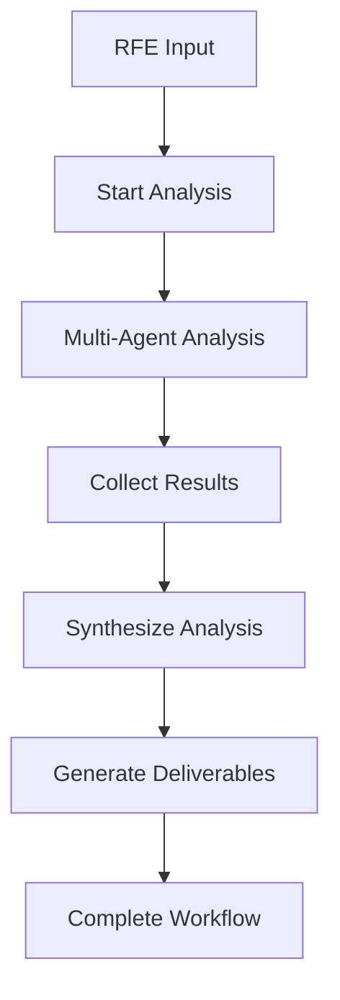

# RHOAI AI Feature Sizing - System Architecture

## Overview

RHOAI implements a production-ready architecture with **LlamaDeploy Python backend** and **@llamaindex/server TypeScript frontend**, designed for enterprise-grade multi-agent analysis workflows.

## Architecture Principles

- **Production First**: Built on LlamaDeploy for enterprise deployment and monitoring
- **Native Python**: Full LlamaIndex capabilities with Python v0.12+ compatibility
- **Modern Frontend**: Professional chat UI with @llamaindex/server
- **API-Driven**: Complete REST API for programmatic access
- **Workflow Orchestration**: Event-driven asynchronous agent coordination
- **Observability**: Built-in monitoring, logging, and health checks

## System Components

### Python Backend (LlamaDeploy)

**Purpose**: Production workflow orchestration and multi-agent coordination

```
┌─────────────────────────────────────────┐
│          PYTHON BACKEND                 │
│          (LlamaDeploy)                  │
│                                         │
│ 🔄 Workflow Engine                     │  
│   • LlamaDeploy orchestration          │
│   • Multi-agent coordination           │
│   • Event-driven state management      │
│                                         │
│ 🤖 Agent System                       │
│   • RFEAgentManager                    │
│   • Persona-specific RAG retrieval     │
│   • Analysis synthesis                 │
│                                         │
│ 📚 Knowledge Integration               │
│   • Python RAG index loading           │
│   • Vector similarity search           │
│   • Context generation                 │
│                                         │
│ 🌐 API Services                       │
│   • REST API endpoints                 │
│   • Streaming responses                │
│   • Health monitoring                  │
└─────────────────────────────────────────┘
```

**Key Files**:
- `backend/src/rfe_builder_workflow.py` - Main RFE Builder workflow definition
- `backend/src/artifact_editor_workflow.py` - Artifact editing workflow
- `backend/src/agents.py` - Multi-agent management
- `backend/llama_deploy.yml` - Deployment configuration

**Services**: 
- LlamaDeploy API Server (port 8000)
- Multi-agent RFE workflow orchestration
- Vector index management and RAG retrieval

### TypeScript Frontend (@llamaindex/server)

**Purpose**: Modern chat interface and user experience

```
┌─────────────────────────────────────────┐
│       TYPESCRIPT FRONTEND              │
│       (@llamaindex/server)             │
│                                         │
│ 💬 Chat Interface                      │
│   • Professional chat UI               │
│   • Streaming response handling        │
│   • Starter questions                  │
│                                         │
│ 🔗 API Integration                     │
│   • LlamaDeploy connection            │
│   • Real-time workflow updates        │
│   • Task management                   │
│                                         │
│ 🎨 User Experience                    │
│   • Responsive design                 │
│   • Progress indicators               │
│   • Error handling                    │
└─────────────────────────────────────────┘
```

**Key Files**:
- `frontend/index.ts` - UI server configuration
- `frontend/package.json` - Dependencies and scripts

**Services**:
- Frontend Server (port 3001)  
- Chat UI with LlamaDeploy integration
- Real-time workflow progress tracking

### Python RAG Ingestion (Separate)

**Purpose**: Knowledge base preparation and indexing

```
┌─────────────────────────────────────────┐
│         RAG INGESTION PIPELINE         │
│                                         │
│ 📥 Data Sources                        │  
│   • GitHub repositories                │
│   • Local documentation                │
│   • Web pages                          │
│                                         │
│ 🔄 Processing                          │
│   • Document chunking                  │
│   • Embedding generation (OpenAI)      │
│   • Metadata extraction                │
│                                         │
│ 💾 Index Creation                      │
│   • FAISS vector stores                │
│   • Persona-specific indices           │
│   • Metadata and statistics            │
└─────────────────────────────────────────┘
```

**Key Files**:
- `python-rag-ingestion/rhoai_rag_ingestion/cli.py` - Ingestion pipeline
- Agent configurations in `src/agents/*.yaml`

**Output**: Vector indexes saved to `output/python-rag/{agent_name}/`

## Data Flow

### Preparation Phase (Python Ingestion)

1. **Agent Config Reading**: Parse YAML configurations from `src/agents/`
2. **Source Processing**: Clone GitHub repositories, read local directories
3. **Document Processing**: Chunk text, generate embeddings via OpenAI
4. **Index Creation**: Build FAISS vector stores with persona-specific metadata
5. **Persistence**: Save indexes to `output/python-rag/{agent_name}/`

### Runtime Phase (LlamaDeploy Workflow)

1. **User Input**: RFE submission via chat interface (port 3001)
2. **Workflow Trigger**: LlamaDeploy receives task via API (port 8000)
3. **Agent Initialization**: Load agent configs and RAG indices
4. **Multi-Agent Analysis**: Parallel analysis by all 7 agent personas
5. **Context Retrieval**: Vector similarity search for each agent's knowledge base
6. **Synthesis**: Combine all agent analyses into comprehensive output
7. **Deliverable Generation**: Create component teams, architecture, timeline
8. **Streaming Response**: Real-time updates back to chat interface

### API Access (Programmatic)

1. **Task Creation**: POST to `/deployments/rhoai/tasks/create`
2. **Event Streaming**: GET `/deployments/rhoai/tasks/{task_id}/events`
3. **Result Retrieval**: Complete analysis results in structured JSON

## Component Communication

### LlamaDeploy API

Frontend and backend communicate via LlamaDeploy API:

```
Frontend (port 3001)  ←──HTTP API──→  LlamaDeploy (port 8000)
│                                            │
├── Chat interface                           ├── Workflow orchestration
├── Real-time updates                        ├── Task management  
└── Progress tracking                        └── Agent coordination
```

### Shared Storage Schema

Python ingestion and backend share filesystem storage:

```
output/python-rag/{agent_persona}/
├── docstore.json         # Document content and metadata
├── default__vector_store.json  # FAISS vector embeddings  
├── index_store.json      # LlamaIndex configuration
├── graph_store.json      # Relationship data
└── metadata.json         # Agent info and statistics
```

### Agent Configuration Schema

Agents are defined in YAML with JSON Schema validation:

```yaml
# yaml-language-server: $schema=./agent-schema.json
name: "Agent Display Name"
persona: "UNIQUE_IDENTIFIER"
role: "Role description"

dataSources:
  - "local-directory"
  - name: "github-source"
    type: "github"
    source: "org/repo"
    options:
      path: "docs/"
      fileTypes: [".md"]

analysisPrompt:
  template: "Analysis prompt with {rfe_description} variables"
  templateVars: ["rfe_description", "context"]
```

## LlamaDeploy Workflow Architecture

### Workflow Steps



### Agent Orchestration

The `RFEWorkflow` coordinates all agent personas:

```python
class RFEWorkflow(Workflow):
    @step
    async def analyze_with_agents(self, ev: RFEAnalysisEvent):
        # Parallel execution of all 7 agents
        events = []
        for persona, config in agent_personas.items():
            analysis = await self.agent_manager.analyze_rfe(
                persona, ev.rfe_description, config
            )
            events.append(AgentAnalysisCompleteEvent(...))
        return events
```

### Multi-Agent Coordination

```
┌─────────────────────────────────────────┐
│           LlamaDeploy Workflow          │
│                                         │
│  ┌───────┐  ┌───────┐  ┌───────────┐   │
│  │  PM   │  │ UXD   │  │BACKEND_ENG│   │
│  └───────┘  └───────┘  └───────────┘   │
│      │          │           │          │
│      └──────────┼───────────┘          │
│                 │                      │
│  ┌───────────┐  │  ┌───────────────┐   │
│  │FRONTEND_  │  │  │   ARCHITECT   │   │
│  │   ENG     │  │  │               │   │
│  └───────────┘  │  └───────────────┘   │
│      │          │           │          │
│      └──────────┼───────────┘          │
│                 │                      │
│         ┌───────────────┐              │
│         │PRODUCT_OWNER │              │
│         │SME_RESEARCHER│              │
│         └───────────────┘              │
│                                         │
│     → Synthesis → Deliverables         │
└─────────────────────────────────────────┘
```

### Workflow Events

1. **RFEAnalysisEvent**: User input triggers workflow
2. **AgentAnalysisCompleteEvent**: Each agent completes analysis
3. **AllAnalysesCompleteEvent**: Synthesis phase begins
4. **SynthesisCompleteEvent**: Generate deliverables
5. **StopEvent**: Workflow completion with results

## Storage Architecture

### Vector Store Strategy

**LlamaIndex + FAISS Integration**:
- Native Python LlamaIndex v0.12+ vector stores
- FAISS backend for efficient similarity search  
- Persona-specific indices for domain expertise
- Persistent storage for production deployment

### Index Loading Strategy

```python
class RFEAgentManager:
    async def get_agent_index(self, persona: str):
        # 1. Try Python RAG index (primary)
        storage_dir = Path(f"../output/python-rag/{persona.lower()}")
        if storage_dir.exists():
            storage_context = StorageContext.from_defaults(persist_dir=storage_dir)
            return load_index_from_storage(storage_context)
        
        # 2. Fall back to LlamaCloud index (if available)
        llamacloud_dir = Path(f"../output/llamacloud/{persona.lower()}")
        if llamacloud_dir.exists():
            storage_context = StorageContext.from_defaults(persist_dir=llamacloud_dir)
            return load_index_from_storage(storage_context)
        
        # 3. No index available
        return None
```

## LlamaDeploy Event System

### Workflow Events

```python
class RFEAnalysisEvent(Event):
    rfe_description: str
    chat_history: List[Dict] = []

class AgentAnalysisCompleteEvent(Event):  
    persona: str
    analysis: Dict[str, Any]

class AllAnalysesCompleteEvent(Event):
    analyses: List[Dict[str, Any]]
    rfe_description: str

class SynthesisCompleteEvent(Event):
    synthesis: Dict[str, Any]
    analyses: List[Dict[str, Any]]
```

### State Management

- **LlamaDeploy Orchestration**: Built-in workflow state management
- **Task Tracking**: Each analysis gets unique task ID
- **Progress Streaming**: Real-time updates via API endpoints
- **Error Recovery**: Graceful handling of individual agent failures
- **Observability**: Built-in monitoring and logging

## Production Deployment

### Scalability Features

- **LlamaDeploy Orchestration**: Enterprise-grade workflow management
- **Parallel Agent Execution**: All agents analyze simultaneously via async/await
- **Persistent Vector Stores**: Indices cached across restarts
- **API-First Design**: RESTful endpoints for horizontal scaling
- **Health Monitoring**: Built-in observability and health checks

### Deployment Architecture

```bash
# 1. Start LlamaDeploy API server
uv run -m llama_deploy.apiserver  # Port 8000

# 2. Deploy workflow
uv run llamactl deploy llama_deploy.yml

# 3. Start frontend
npm run dev  # Port 3001

# 4. Optional: Scheduled ingestion updates
0 2 * * * cd /app/python-rag-ingestion && rhoai-rag ingest
```

### Production Monitoring

```bash
# Check deployment status
uv run llamactl status

# View workflow logs  
uv run llamactl logs rfe-builder-workflow

# Monitor tasks
uv run llamactl tasks

# Health checks
curl http://localhost:8000/health
curl http://localhost:3001/health
```

## Development Workflow

### Adding New Agents

1. Create YAML configuration in `src/agents/`
2. Configure data sources (local directories or GitHub repositories)
3. Run Python ingestion: `cd python-rag-ingestion && rhoai-rag ingest`
4. Restart backend: LlamaDeploy automatically reloads agent configurations

### Updating Knowledge Bases

1. **Local Sources**: Update files in `data/` directories, re-run ingestion
2. **GitHub Sources**: Re-run Python ingestion to pull latest commits
3. **Agent Config**: Modify YAML files, LlamaDeploy hot-reloads configurations

### Backend Development

```bash
cd backend

# Install development dependencies
uv sync --dev

# Run tests
uv run pytest

# Type checking  
uv run mypy src/

# Restart workflow
uv run llamactl deploy llama_deploy.yml
```

### Frontend Development

```bash
cd frontend

# Install dependencies
npm install

# Development mode with hot reload
npm run dev

# Build for production
npm run build
```

## Integration Points

### API Endpoints

- **Task Management**: `/deployments/rhoai/tasks/*`
- **Event Streaming**: `/deployments/rhoai/tasks/{task_id}/events`
- **Health Checks**: `/health`, `/docs`
- **Workflow Status**: `/deployments/rhoai/status`

### External Systems

- **OpenAI API**: GPT-4 language model and text-embedding-3-small
- **GitHub API**: Repository access and documentation retrieval (via python-rag-ingestion)
- **LlamaDeploy**: Production workflow orchestration and monitoring

### Extension Capabilities

- **Custom Workflows**: Extend `RFEWorkflow` with additional analysis steps
- **Agent Specializations**: Create domain-specific agent personas and prompts
- **Data Source Integration**: Add new readers to python-rag-ingestion pipeline
- **UI Customization**: Configure @llamaindex/server chat interface
- **API Integration**: Build external applications using REST endpoints

This production-ready architecture provides enterprise-grade multi-agent analysis with built-in scalability, monitoring, and extensibility for complex feature refinement workflows.
