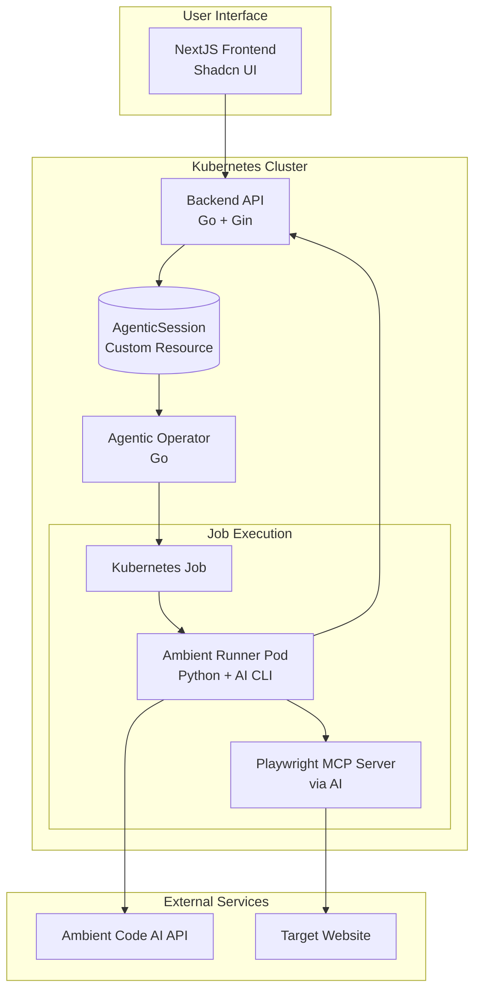

****# Ambient Agentic Runner

A Kubernetes application for running automated agentic sessions using Ambient Code AI with integrated MCP server capabilities. This system allows users to create agentic jobs that use AI to perform various tasks including website analysis, automation, and data processing through MCP.

## ✨ Features

- **Web-based UI**: Modern NextJS application with Shadcn UI components
- **Agentic Job Management**: Create, monitor, and view results of agentic sessions
- **AI Integration**: Leverages Ambient Code AI for intelligent analysis
- **MCP Integration**: Uses AI with Playwright MCP server for web automation
- **Kubernetes Native**: Built with Kubernetes Custom Resources and Operators
- **Scalable Architecture**: Containerized microservices with proper RBAC
- **Real-time Updates**: Live status updates of agentic job progress

## 🏗️ Architecture



## 🚀 Components

| Component | Technology | Description |
|-----------|------------|-------------|
| **Frontend** | NextJS + Shadcn | User interface for managing agentic sessions |
| **Backend API** | Go + Gin | REST API for managing Kubernetes Custom Resources |
| **Agentic Operator** | Go | Kubernetes operator that watches CRs and creates Jobs |
| **Ambient Runner** | Python + AI CLI | Pod that executes AI with Playwright MCP server |
| **Playwright MCP** | MCP Server | Provides browser automation capabilities to AI |

### Directory Structure

```
components/
├── frontend/                   # NextJS application with Shadcn UI
├── backend/                    # Go API service using Kubernetes SDK
├── operator/                   # Kubernetes operator in Go
├── runners/                    # AI runner services
│   └── claude-code-runner/     # Python service running Claude Code CLI with MCP
├── manifests/                  # Kubernetes deployment manifests
└── README.md                   # This documentation
```

## 🎯 Agentic Session Flow

1. **Create Session**: User creates a new agentic session via the web UI
2. **API Processing**: Backend creates an `AgenticSession` Custom Resource in Kubernetes
3. **Job Scheduling**: Operator detects the CR and creates a Kubernetes Job
4. **Execution**: Job runs a pod with AI CLI and Playwright MCP server
5. **Task Execution**: AI executes the specified task using MCP capabilities
6. **Result Storage**: Results are stored back in the Custom Resource
7. **UI Update**: Frontend displays the completed agentic session with results

## ⚡ Quick Start

See [../OPENSHIFT_DEPLOY.md](../OPENSHIFT_DEPLOY.md) for complete deployment instructions.

## 🔧 Configuration

### Environment Variables

**Ambient Runner Pod:**
- `AMBIENT_API_KEY`: Your Ambient Code AI API key (required)
- `AGENTIC_SESSION_NAME`: Name of the agentic session
- `PROMPT`: Prompt for AI
- `WEBSITE_URL`: Website to analyze
- `LLM_MODEL`: AI model to use (default: ambient-ai-v1)
- `LLM_TEMPERATURE`: Model temperature (default: 0.7)
- `LLM_MAX_TOKENS`: Maximum tokens (default: 4000)
- `TIMEOUT`: Session timeout in seconds (default: 300)

**MCP Configuration:**
- Playwright MCP server is automatically configured via `.mcp.json`
- Chrome runs in headless mode with vision capabilities enabled
- Browser automation tools are available to AI via MCP protocol

### Supported AI Models
- `ambient-ai-v1` (Default)
- `ambient-ai-fast`
- `ambient-ai-advanced`

## 📖 Documentation

- [**Setup Guide**](./docs/SETUP.md) - Detailed installation and configuration
- [**API Documentation**](./docs/API.md) - REST API reference and examples

## 🔍 Example Usage

1. **Access the web interface** at `http://localhost:3000`
2. **Click "New Agentic Session"** to create an agentic job
3. **Fill out the form:**
   - **Prompt**: "Analyze this website's user experience and identify key features"
   - **Website URL**: "https://example.com"
   - **Model**: "Ambient AI v1"
   - **Settings**: Adjust temperature and token limits as needed
4. **Submit** and monitor the job progress in real-time
5. **View results** once the analysis is complete

## 🛠️ Development

### Local Development
```bash
# Frontend development
cd frontend && npm run dev

# Backend development  
cd backend && go run main.go

# Test with local Kubernetes cluster
kind create cluster --name ambient-agentic
```

### Building Images
```bash
# Build all images with one command
make build-all

# Or build individually
make build-frontend
make build-backend  
make build-operator
make build-runner
```

## 📊 Monitoring

Monitor your agentic sessions:

```bash
# Check pod status
kubectl get pods -l app=ambient-agentic

# View logs (ambient-code namespace)
kubectl logs -n ambient-code deployment/agentic-operator
kubectl logs -n ambient-code deployment/backend-api

# Monitor agentic sessions
kubectl get agenticsessions
kubectl describe agenticsession <session-name>
```

## 🔐 Security Considerations

- **API Keys**: Stored securely in Kubernetes secrets
- **RBAC**: Proper role-based access control configured. Ambient-managed projects must be labeled `ambient-code.io/managed=true`. Group access is managed via RoleBindings to cluster roles `ambient-project-admin`, `ambient-project-edit`, `ambient-project-view`.
- **Network Policies**: Restrict pod-to-pod communication as needed
- **Resource Limits**: CPU and memory limits set on all containers

## 🚧 Roadmap

- [ ] **Session Control**: Add pause/resume functionality for long-running sessions
- [ ] **Authentication**: Add user authentication and authorization
- [ ] **Monitoring**: Prometheus metrics and Grafana dashboards
- [ ] **WebSocket Support**: Real-time status updates via WebSocket
- [ ] **Multi-tenancy**: Support for multiple users and organizations

## 🐛 Troubleshooting

Common issues and solutions:

```bash
# Check if all services are healthy
kubectl get pods --all-namespaces | grep ambient

# View operator logs for job creation issues
kubectl logs -n ambient-code deployment/agentic-operator -f

# Check API connectivity
kubectl port-forward svc/backend-service 8080:8080
curl http://localhost:8080/health
```

See the repository root `README.md` for deployment and troubleshooting guides.

## 🤝 Contributing

1. Fork the repository
2. Create a feature branch
3. Make your changes
4. Add tests if applicable
5. Submit a pull request

## 📄 License

This project is licensed under the MIT License - see the LICENSE file for details.

## 🙏 Acknowledgments

- [Ambient Code](https://ambient-code.com/) for Ambient AI and AI CLI
- [Playwright MCP](https://github.com/microsoft/playwright) for web automation capabilities  
- [Shadcn/ui](https://ui.shadcn.com/) for beautiful UI components
- The Kubernetes community for the excellent operator framework
