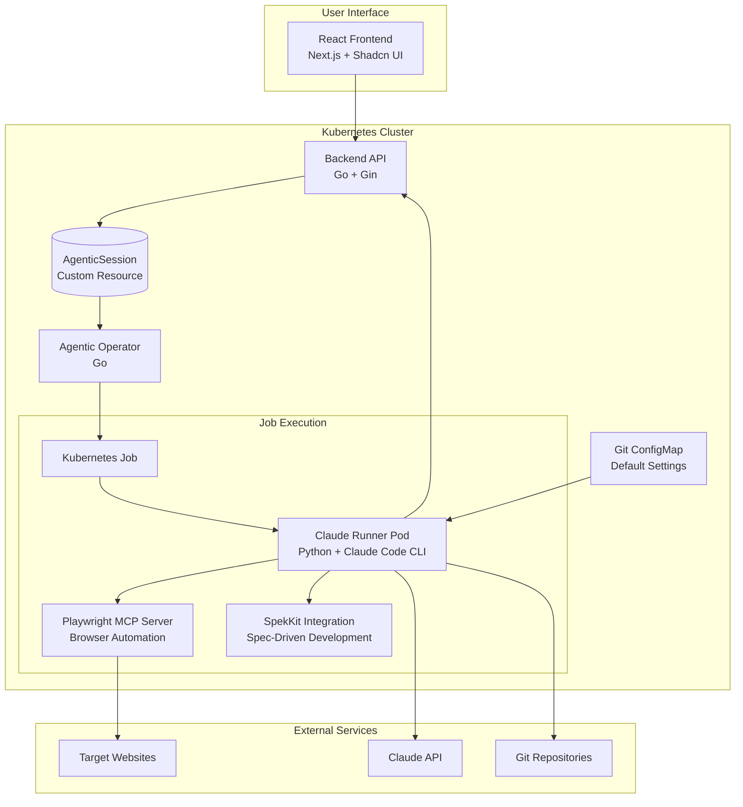

# vTeam - AI Automation Platform

A Kubernetes-native AI automation platform that combines Claude Code CLI with browser automation and spec-driven development capabilities. Create AI sessions for website analysis, generate specifications, implementation plans, and development tasks.

## ✨ Features

- **Web-based UI**: React frontend for creating and monitoring AI sessions
- **Website Analysis**: AI-powered browser automation using Playwright MCP
- **Spec-Driven Development**: Generate specifications, plans, and tasks with `/specify`, `/plan`, `/tasks` commands
- **Git Integration**: Clone repositories, configure Git users, support SSH/token authentication
- **Configurable Defaults**: Set organization-wide Git repositories via ConfigMap
- **Kubernetes Native**: Built with Custom Resources and Operators
- **Real-time Updates**: Live status updates of AI session progress

## 🏗️ Architecture



## 🚀 Components

| Component | Technology | Description |
|-----------|------------|-------------|
| **Frontend** | Next.js + Shadcn | User interface for managing AI sessions |
| **Backend API** | Go + Gin | REST API for managing Kubernetes Custom Resources |
| **Agentic Operator** | Go | Kubernetes operator that creates and monitors Jobs |
| **Claude Runner** | Python + Claude Code CLI | Executes AI tasks with browser automation and SpekKit |
| **Git ConfigMap** | Kubernetes ConfigMap | Default Git configuration and repositories |

## 🎯 AI Session Types

### 1. Website Analysis
- Navigate and analyze websites with AI-powered browser automation
- Take screenshots, extract content, interact with elements
- Generate comprehensive analysis reports

### 2. Spec-Driven Development
- **`/specify [requirements]`**: Generate feature specifications from natural language
- **`/plan [tech details]`**: Create detailed implementation plans
- **`/tasks [notes]`**: Break down features into actionable development tasks

### 3. Git Integration
- Clone and work with repositories during AI sessions
- Support for SSH keys and personal access tokens
- Configurable default repositories via ConfigMap

## 🔧 Building Images

### Prerequisites
- Docker, Podman or compatible container runtime
- Access to container registry (default: quay.io/ambient_code)

### Build All Images
```bash
# Navigate to components directory
cd components

# Build frontend
cd frontend
podman build --platform=linux/amd64 -t quay.io/ambient_code/vteam_frontend:latest .

# Build backend
cd backend
podman build --platform=linux/amd64 -t quay.io/ambient_code/vteam_backend:latest .

# Build operator
cd operator
podman build --platform=linux/amd64 -t quay.io/ambient_code/vteam_operator:latest .

# Build claude runner
cd runners/claude-code-runner
podman build --platform=linux/amd64 -t quay.io/ambient_code/vteam_claude_runner:latest .

# Push to registry
podman push quay.io/ambient_code/vteam_frontend:latest
podman push quay.io/ambient_code/vteam_backend:latest
podman push quay.io/ambient_code/vteam_operator:latest
podman push quay.io/ambient_code/vteam_claude_runner:latest
```

### Custom Registry
To use your own registry, update image references in:
- `manifests/kustomization.yaml` (image names)
- `manifests/operator-deployment.yaml` (AMBIENT_CODE_RUNNER_IMAGE env var)

## 🚀 Deployment

### Option 1: Deploy with Default Images
Uses pre-built images from quay.io/ambient_code:

```bash
cd components/manifests
./deploy.sh
```

### Option 2: Deploy with Custom Images
Build and push your images, then deploy with environment variables:

```bash
# Deploy with custom images
cd components/manifests
NAMESPACE=your-namespace-here \
DEFAULT_BACKEND_IMAGE=quay.io/sallyom/vteam:backend-git \
DEFAULT_FRONTEND_IMAGE=quay.io/sallyom/vteam:frontend-git \
DEFAULT_OPERATOR_IMAGE=quay.io/sallyom/vteam:operator-git \
DEFAULT_RUNNER_IMAGE=quay.io/sallyom/vteam:claude-runner-git \
./deploy.sh
```

Alternative: Update `manifests/kustomization.yaml` with your registry and run `./deploy.sh`

## 🔐 Required Secrets

**IMPORTANT**: Create secrets manually before deployment. Secrets are not included in Kustomize for security.

### Create Anthropic API Key Secret
```bash
kubectl create secret generic anthropic-api-key \
  --from-literal=api-key="your-anthropic-api-key-here"
```

### Optional Git Secrets
For private repository access:

```bash
# SSH Key (for SSH-based Git access)
kubectl create secret generic git-ssh-key \
  --from-file=ssh-privatekey=/path/to/private/key

# Personal Access Token (for HTTPS-based Git access)
kubectl create secret generic git-token \
  --from-literal=token="your-git-token-here"
```

## ⚙️ Configuration

### Git ConfigMap (Optional)
Configure default Git settings and repositories:

```yaml
# Edit manifests/git-configmap.yaml
apiVersion: v1
kind: ConfigMap
metadata:
  name: git-config
data:
  git-user-name: "vTeam Bot"
  git-user-email: "vteam@example.com"
  git-ssh-key-secret: "git-ssh-key"
  git-token-secret: "git-token"
  git-repositories: |
    https://github.com/your-org/project.git
    https://github.com/your-org/docs.git
```

### Environment Variables

**Operator Configuration:**
- `IMAGE_PULL_POLICY`: Image pull policy for claude-runner jobs (default: "Always")
- `AMBIENT_CODE_RUNNER_IMAGE`: Claude runner image to use

**Per-Session Variables** (set automatically):
- `ANTHROPIC_API_KEY`: Claude API key (from secret)
- `AGENTIC_SESSION_NAME`: Session identifier
- `PROMPT`: User-provided prompt
- `WEBSITE_URL`: Target website URL
- `TIMEOUT`: Session timeout (default: 300s)

## 📖 Access and Usage

### Access the UI
```bash
# Check for OpenShift route
oc get route frontend-route

# Or port forward
kubectl port-forward svc/frontend-service 3000:3000
# Open http://localhost:3000
```

### Example Usage

1. **Website Analysis**:
   - Prompt: "Analyze the pricing page and summarize the tiers"
   - Website: "https://example.com/pricing"

2. **Spec-Driven Development**:
   - Prompt: "/specify Build a user dashboard with charts and data filters"
   - Follow with: "/plan Use React and Node.js with PostgreSQL"
   - Complete with: "/tasks Focus on backend API development first"

3. **Git Integration**:
   - Configure Git settings in the UI or use ConfigMap defaults
   - AI sessions can clone and work with repositories

## 🔍 Monitoring

```bash
# Check deployment status
kubectl get pods -l app=backend-api
kubectl get pods -l app=frontend
kubectl get pods -l app=agentic-operator

# Monitor AI sessions
kubectl get agenticsessions
kubectl describe agenticsession <session-name>

# View logs
kubectl logs -l app=agentic-operator -f
kubectl logs -l app=backend-api -f

# Check Job execution
kubectl get jobs
kubectl logs job/<job-name>
```

## 🐛 Troubleshooting

### Common Issues
```bash
# Check if secrets exist
kubectl get secrets

# Verify ConfigMap
kubectl get configmap git-config -o yaml

# Check operator logs for job creation issues
kubectl logs -l app=agentic-operator -f

# Test API connectivity
kubectl port-forward svc/backend-service 8080:8080
curl http://localhost:8080/health
```

### Image Pull Issues
- Verify `imagePullPolicy: Always` is set in deployments
- Check registry credentials and image availability
- Review operator logs for container creation errors

## 🧹 Cleanup

```bash
cd components/manifests
kubectl delete -f .
kubectl delete crd agenticsessions.vteam.ambient-code
```

## 📚 Additional Documentation

- [**OpenShift Deployment Guide**](../OPENSHIFT_DEPLOY.md) - Quick deployment reference
- [**Secret Setup Guide**](./SECRET_SETUP.md) - Detailed secret configuration

## 🤝 Contributing

1. Fork the repository
2. Create a feature branch
3. Build and test your changes
4. Submit a pull request

## 📄 License

This project is licensed under the MIT License.
