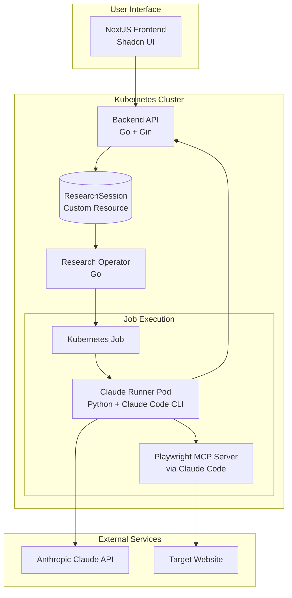

****# Claude Research Runner

A Kubernetes application for running automated research sessions using Claude Code CLI with integrated MCP server capabilities. This system allows users to create research jobs that use Claude to analyze websites with browser automation through MCP.

## ✨ Features

- **Web-based UI**: Modern NextJS application with Shadcn UI components
- **Research Job Management**: Create, monitor, and view results of research sessions
- **Claude Integration**: Leverages Anthropic's Claude AI for intelligent analysis
- **MCP Integration**: Uses Claude Code CLI with Playwright MCP server for web automation
- **Kubernetes Native**: Built with Kubernetes Custom Resources and Operators
- **Scalable Architecture**: Containerized microservices with proper RBAC
- **Real-time Updates**: Live status updates of research job progress

## 🏗️ Architecture



## 🚀 Components

| Component | Technology | Description |
|-----------|------------|-------------|
| **Frontend** | NextJS + Shadcn | User interface for managing research sessions |
| **Backend API** | Go + Gin | REST API for managing Kubernetes Custom Resources |
| **Research Operator** | Go | Kubernetes operator that watches CRs and creates Jobs |
| **Claude Runner** | Python + Claude Code CLI | Pod that executes Claude Code with Playwright MCP server |
| **Playwright MCP** | MCP Server | Provides browser automation capabilities to Claude Code |

### Directory Structure

```
claude-runner/
├── frontend/          # NextJS application with Shadcn UI
├── backend/           # Go API service using Kubernetes SDK
├── operator/          # Kubernetes operator in Go
├── claude-runner/     # Python service running Claude with MCP
├── manifests/     # Kubernetes deployment manifests
└── docs/              # Documentation and setup guides
```

## 🎯 Research Session Flow

1. **Create Session**: User creates a new research session via the web UI
2. **API Processing**: Backend creates a `ResearchSession` Custom Resource in Kubernetes
3. **Job Scheduling**: Operator detects the CR and creates a Kubernetes Job
4. **Execution**: Job runs a pod with Claude Code CLI and Playwright MCP server
5. **Analysis**: Claude Code analyzes the specified website using MCP browser automation
6. **Result Storage**: Results are stored back in the Custom Resource
7. **UI Update**: Frontend displays the completed research session with results

## ⚡ Quick Start

### Prerequisites
- Kubernetes cluster (local or cloud)
- kubectl configured
- Docker for building images
- Anthropic API key

### Deploy
```bash
# Clone the repository
git clone <repository-url>
cd claude-runner

# Build all images
docker build --platform=linux/amd64 -t claude-runner-backend:latest ./backend/
docker build --platform=linux/amd64 -t claude-runner-frontend:latest ./frontend/
docker build --platform=linux/amd64 -t research-operator:latest ./operator/
docker build --platform=linux/amd64 -t claude-runner:latest ./claude-runner/

# Configure your Anthropic API key
echo -n "your-api-key" | base64  # Use this in secrets.yaml

# Deploy to Kubernetes
cd manifests
./deploy.sh
```

### Access
```bash
# Port forward to access the UI
kubectl port-forward svc/frontend-service 3000:3000

# Open http://localhost:3000 in your browser
```

## 🔧 Configuration

### Environment Variables

**Claude Runner Pod:**
- `ANTHROPIC_API_KEY`: Your Anthropic API key (required)
- `RESEARCH_SESSION_NAME`: Name of the research session
- `PROMPT`: Research prompt for Claude Code
- `WEBSITE_URL`: Website to analyze
- `LLM_MODEL`: Claude model to use (default: claude-3-5-sonnet-20241022)
- `LLM_TEMPERATURE`: Model temperature (default: 0.7)
- `LLM_MAX_TOKENS`: Maximum tokens (default: 4000)
- `TIMEOUT`: Session timeout in seconds (default: 300)

**MCP Configuration:**
- Playwright MCP server is automatically configured via `.mcp.json`
- Chrome runs in headless mode with vision capabilities enabled
- Browser automation tools are available to Claude Code via MCP protocol

### Supported Claude Models
- `claude-3-5-sonnet-20241022` (Default)
- `claude-3-haiku-20240307`
- `claude-3-opus-20240229`

## 📖 Documentation

- [**Setup Guide**](./docs/SETUP.md) - Detailed installation and configuration
- [**API Documentation**](./docs/API.md) - REST API reference and examples

## 🔍 Example Usage

1. **Access the web interface** at `http://localhost:3000`
2. **Click "New Research Session"** to create a research job
3. **Fill out the form:**
   - **Prompt**: "Analyze this website's user experience and identify key features"
   - **Website URL**: "https://example.com"
   - **Model**: "Claude 3.5 Sonnet"
   - **Settings**: Adjust temperature and token limits as needed
4. **Submit** and monitor the job progress in real-time
5. **View results** once the analysis is complete

## 🛠️ Development

### Local Development
```bash
# Frontend development
cd frontend && npm run dev

# Backend development  
cd backend && go run main.go

# Test with local Kubernetes cluster
kind create cluster --name claude-research
```

### Building Images
```bash
# Build all images with one command
make build-all

# Or build individually
make build-frontend
make build-backend  
make build-operator
make build-runner
```

## 📊 Monitoring

Monitor your research sessions:

```bash
# Check pod status
kubectl get pods -l app=claude-research

# View logs
kubectl logs -l app=research-operator
kubectl logs -l app=backend-api

# Monitor research sessions
kubectl get researchsessions
kubectl describe researchsession <session-name>
```

## 🔐 Security Considerations

- **API Keys**: Stored securely in Kubernetes secrets
- **RBAC**: Proper role-based access control configured
- **Network Policies**: Restrict pod-to-pod communication as needed
- **Resource Limits**: CPU and memory limits set on all containers

## 🚧 Roadmap

- [ ] **Session Control**: Add pause/resume functionality for long-running sessions
- [ ] **Authentication**: Add user authentication and authorization
- [ ] **Monitoring**: Prometheus metrics and Grafana dashboards
- [ ] **WebSocket Support**: Real-time status updates via WebSocket
- [ ] **Multi-tenancy**: Support for multiple users and organizations

## 🐛 Troubleshooting

Common issues and solutions:

```bash
# Check if all services are healthy
kubectl get pods --all-namespaces | grep claude

# View operator logs for job creation issues
kubectl logs -l app=research-operator -f

# Check API connectivity
kubectl port-forward svc/backend-service 8080:8080
curl http://localhost:8080/health
```

See [SETUP.md](./docs/SETUP.md) for detailed troubleshooting guides.

## 🤝 Contributing

1. Fork the repository
2. Create a feature branch
3. Make your changes
4. Add tests if applicable
5. Submit a pull request

## 📄 License

This project is licensed under the MIT License - see the LICENSE file for details.

## 🙏 Acknowledgments

- [Anthropic](https://www.anthropic.com/) for Claude AI and Claude Code CLI
- [Playwright MCP](https://github.com/microsoft/playwright) for web automation capabilities  
- [Shadcn/ui](https://ui.shadcn.com/) for beautiful UI components
- The Kubernetes community for the excellent operator framework
