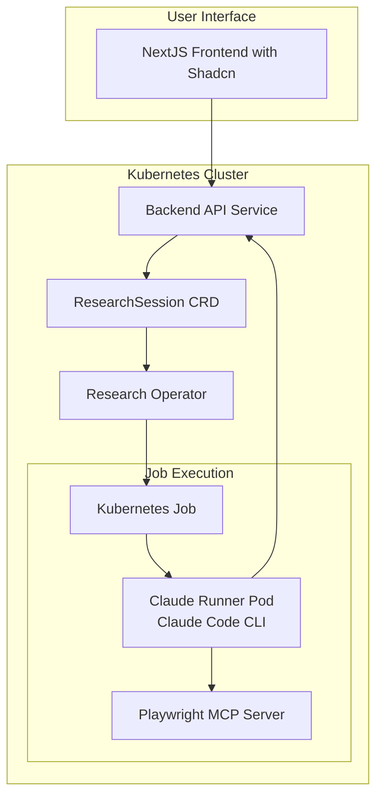

# Claude Research Runner - Setup Guide

## Prerequisites

Before setting up the Claude Research Runner, ensure you have the following:

### Required Tools
- **Kubernetes cluster** (local with minikube/kind or cloud-based)
- **kubectl** configured to access your cluster
- **Docker** for building container images
- **Go 1.24+** for building backend services
- **Node.js 18+** and **npm** for the frontend

### Required Accounts & API Keys
- **Anthropic API Key** - Get one from [Anthropic Console](https://console.anthropic.com/)
- **Container Registry Access** - For storing Docker images

## Architecture Overview

The system consists of several components:



## Quick Start

### 1. Clone and Build

```bash
# Clone the repository
git clone <your-repo-url>
cd claude-runner

# Build all Docker images
docker build -t claude-runner-backend:latest ./backend/
docker build -t claude-runner-frontend:latest ./frontend/
docker build -t research-operator:latest ./operator/
docker build -t claude-runner:latest ./claude-runner/
```

### 2. Configure Secrets

```bash
# Encode your Anthropic API key
echo -n "your-anthropic-api-key-here" | base64

# Update manifests/secrets.yaml with the encoded key
```

### 3. Deploy to Kubernetes

```bash
cd manifests
./deploy.sh
```

### 4. Access the Application

```bash
# Option 1: Port forward (for testing)
kubectl port-forward svc/frontend-service 3000:3000

# Option 2: Add to /etc/hosts (for ingress)
echo "127.0.0.1 claude-research.local" | sudo tee -a /etc/hosts

# Then access: http://localhost:3000 or http://claude-research.local
```

## Detailed Setup

### Building Components

#### Frontend (NextJS with Shadcn)
```bash
cd frontend
npm install
npm run build
docker build -t claude-runner-frontend:latest .
```

#### Backend API (Go)
```bash
cd backend
go mod tidy
docker build -t claude-runner-backend:latest .
```

#### Research Operator (Go)
```bash
cd operator
go mod tidy
docker build -t research-operator:latest .
```

#### Claude Runner (Python with Claude Code CLI)
```bash
cd claude-runner
docker build -t claude-runner:latest .
```

### Kubernetes Deployment

#### 1. Deploy Custom Resource Definition
```bash
kubectl apply -f manifests/crd.yaml
```

#### 2. Deploy RBAC Configuration
```bash
kubectl apply -f manifests/rbac.yaml
```

#### 3. Deploy Secrets and Config
```bash
# Update secrets.yaml with your API key first
kubectl apply -f manifests/secrets.yaml
```

#### 4. Deploy Services
```bash
kubectl apply -f manifests/backend-deployment.yaml
kubectl apply -f manifests/operator-deployment.yaml
kubectl apply -f manifests/frontend-deployment.yaml
```

### Verification

Check that all components are running:

```bash
# Check pods
kubectl get pods

# Check services
kubectl get services

# Check custom resources
kubectl get researchsessions

# View logs
kubectl logs -l app=backend-api
kubectl logs -l app=research-operator
kubectl logs -l app=frontend
```

## Configuration

### Environment Variables

#### Backend API
- `NAMESPACE`: Kubernetes namespace (default: "default")
- `PORT`: API server port (default: "8080")

#### Research Operator
- `NAMESPACE`: Kubernetes namespace (default: "default")
- `BACKEND_API_URL`: Backend API URL for status updates

#### Claude Runner
- `ANTHROPIC_API_KEY`: Your Anthropic API key (required)
- `RESEARCH_SESSION_NAME`: Name of the research session
- `PROMPT`: Research prompt passed directly to Claude Code CLI
- `WEBSITE_URL`: Website to analyze
- `LLM_MODEL`: Claude model to use
- `LLM_TEMPERATURE`: Model temperature
- `LLM_MAX_TOKENS`: Maximum tokens
- `TIMEOUT`: Execution timeout

**Technical Implementation:**
- Uses Claude Code CLI with integrated Playwright MCP server
- Prompts are passed directly via `--prompt` flag (no temp files)
- MCP server configuration is loaded from `.mcp.json`
- Browser automation runs in headless Chrome with vision capabilities

### Secrets Management

The application uses Kubernetes secrets for sensitive data:

```yaml
# manifests/secrets.yaml
apiVersion: v1
kind: Secret
metadata:
  name: claude-research-secrets
type: Opaque
data:
  anthropic-api-key: <base64-encoded-key>
```

## Troubleshooting

### Common Issues

#### 1. Pods Not Starting
```bash
# Check pod status and events
kubectl describe pod <pod-name>

# Check logs
kubectl logs <pod-name>
```

#### 2. API Connection Issues
```bash
# Check service endpoints
kubectl get endpoints

# Test API connectivity
kubectl exec -it <pod-name> -- curl http://backend-service:8080/health
```

#### 3. Custom Resource Issues
```bash
# Check CRD installation
kubectl get crd researchsessions.research.example.com

# Check operator logs
kubectl logs -l app=research-operator
```

#### 4. Job Failures
```bash
# List jobs
kubectl get jobs

# Check job details
kubectl describe job <job-name>

# Check pod logs from failed jobs
kubectl logs <job-pod-name>
```

### Debug Commands

```bash
# Get all resources
kubectl get all -l app=claude-research

# Check events
kubectl get events --sort-by='.lastTimestamp'

# Port forward for local testing
kubectl port-forward svc/backend-service 8080:8080
kubectl port-forward svc/frontend-service 3000:3000

# Check resource usage
kubectl top pods
```

## Development

### Local Development

#### Frontend Development
```bash
cd frontend
npm run dev
```

#### Backend Development
```bash
cd backend
export KUBECONFIG=~/.kube/config
go run main.go
```

#### Testing with Kind

```bash
# Create local cluster
kind create cluster --name claude-research

# Load images into kind
kind load docker-image claude-runner-backend:latest --name claude-research
kind load docker-image claude-runner-frontend:latest --name claude-research
kind load docker-image research-operator:latest --name claude-research
kind load docker-image claude-runner:latest --name claude-research

# Deploy
cd manifests
./deploy.sh
```

## Next Steps

1. **Session Management**: Add pause/resume and better session control features.
2. **Monitoring**: Add Prometheus metrics and Grafana dashboards.
3. **Persistence**: Add database for storing research results long-term.
4. **Authentication**: Add user authentication and authorization.
5. **Scaling**: Configure horizontal pod autoscaling.

## Support

For issues and questions:
1. Check the troubleshooting section above
2. View logs using the debug commands
3. Check Kubernetes events
4. Review the component architecture diagram
