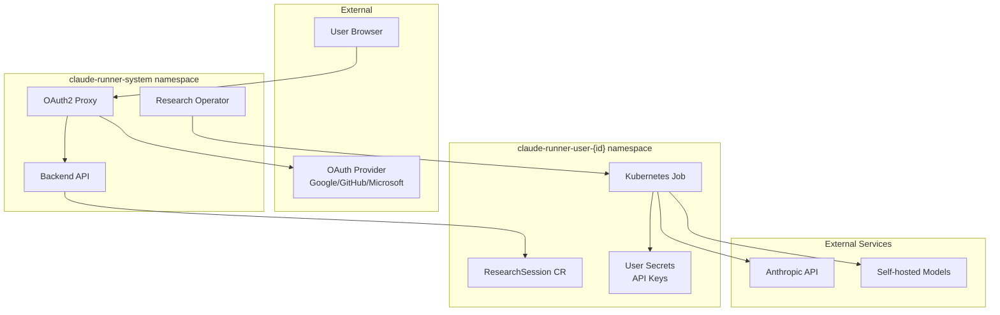

# CREP-001: Multi-Tenant Architecture Implementation

**Authors:** @gkrumbac  
**Status:** Draft  
**Creation Date:** 2024-01-XX  
**Last Updated:** 2024-01-XX

## Summary
Transform Claude Runner into a secure multi-tenant platform with namespace isolation, OAuth2 authentication, and resource quotas.

## Motivation
### Goals
- Support multiple users/organizations with complete isolation
- Implement industry-standard authentication (OAuth2/OIDC)  
- Enable self-service user onboarding
- Provide usage-based resource quotas
- Support both external APIs and self-hosted models

### Non-Goals
- Billing/payment integration (future phase)
- Multi-cloud deployment (single cluster focus)
- Legacy session format support

### User Stories
- As a **platform administrator**, I want to onboard new organizations safely
- As a **research user**, I want to manage my own API keys and quotas
- As a **security team member**, I want to audit all cross-tenant access
- As a **organization admin**, I want to control my team's model access

## Proposal
### Current State vs Target State

| Aspect | Current State | Target State |
|--------|---------------|--------------|
| **Tenancy** | Single namespace, shared resources | Namespace-per-tenant with isolation |
| **Authentication** | None | OAuth2/OIDC with major providers |
| **Authorization** | Basic K8s RBAC | Fine-grained multi-tenant RBAC |
| **API Keys** | Shared Anthropic key | Per-user secrets management |
| **Resources** | Unlimited usage | Quota-based resource management |
| **Monitoring** | System-level only | Per-tenant metrics and isolation |
| **Models** | Anthropic Claude only | Multiple providers + self-hosted |
| **Security** | Basic K8s security | OWASP-compliant microservices security |

### Architecture Overview

#### Multi-Tenant Namespace Strategy
**Application Namespace (`claude-runner-system`):**
- Shared infrastructure components (OAuth proxy, operators, monitoring)
- System-wide services and controllers
- Model servers for self-hosted models

**Per-Tenant Namespaces (`claude-runner-user-{user-id}`):**
- Isolated user workloads and data
- User-specific secrets (API keys, tokens)
- Custom resources owned by the user
- Network policies for isolation

#### Authentication & Identity Flow


#### Security Model (OWASP-Compliant)
Following OWASP Microservices Security patterns:

**Edge-level Authorization:**
- OAuth2 proxy handles external authentication
- Token validation and user identity extraction
- Rate limiting and DDoS protection

**Service-level Authorization:**
- User passport system with HMAC signatures
- Per-namespace RBAC enforcement
- Fine-grained permissions for resources

**Identity Propagation:**
```go
type UserPassport struct {
    UserID      string   `json:"user_id"`
    Email       string   `json:"email"`
    Groups      []string `json:"groups"`
    Permissions []string `json:"permissions"`
    Tier        string   `json:"tier"`
    Namespace   string   `json:"namespace"`
    Signature   string   `json:"signature"` // HMAC for integrity
}
```

**Network Isolation:**
- Kubernetes NetworkPolicies for tenant separation
- Application namespace ingress/egress rules
- Restricted external API access

### Implementation Phases

#### Phase 1: Authentication & Foundation (Weeks 1-2)
**Theme:** "Secure the Gate"

**Week 1: OAuth2 Integration**
- [ ] **OAuth2 Proxy Setup**
  - Deploy oauth2-proxy with OIDC support
  - Configure with Google, GitHub, Microsoft providers
  - Test authentication flows
  - **Deliverable:** Working OAuth integration

- [ ] **API Identity Middleware**
  - Implement user passport system (OWASP pattern)
  - Add HMAC signing for identity propagation
  - Create middleware for request authentication
  - **Deliverable:** Secure API with user context

**Week 2: Namespace Foundation**
- [ ] **Tenant Management System**
  - Create Tenant CRD
  - Implement tenant controller
  - Build namespace provisioning
  - **Deliverable:** Automatic namespace creation

- [ ] **RBAC Implementation**
  - Design multi-tenant role system
  - Create per-namespace service accounts
  - Implement authorization middleware
  - **Deliverable:** Working RBAC system

**🎯 Phase 1 Success Criteria:**
- Users can authenticate via OAuth2
- Each user gets isolated namespace
- API enforces user-based access control
- No cross-tenant access possible

#### Phase 2: User Experience & API Key Management (Weeks 3-4)
**Theme:** "Seamless Onboarding"

**Week 3: User Onboarding**
- [ ] **Setup Wizard UI**
  - Design onboarding flow
  - Build welcome/setup pages
  - Integrate namespace status checks
  - **Deliverable:** Complete setup wizard

- [ ] **API Key Management**
  - Create API key setup form
  - Implement secure secret storage
  - Add key validation and testing
  - **Deliverable:** Self-service API key setup

**Week 4: Enhanced API & Quota System**
- [ ] **Multi-tenant API Updates**
  - Update all endpoints for tenant isolation
  - Add quota validation
  - Implement usage tracking
  - **Deliverable:** Fully tenant-aware API

- [ ] **Quota Management**
  - Define quota tiers (standard/premium/enterprise)
  - Implement usage enforcement
  - Add quota dashboard for users
  - **Deliverable:** Working quota system

**🎯 Phase 2 Success Criteria:**
- New users can onboard in < 5 minutes
- Users manage their own API keys
- Quota limits are enforced
- Clear tier-based pricing model

#### Phase 3: Security & Monitoring (Weeks 5-6)
**Theme:** "Zero Trust, Full Visibility"

**Week 5: Network Security**
- [ ] **Network Policies**
  - Implement tenant isolation policies
  - Add application namespace policies
  - Test cross-namespace communication
  - **Deliverable:** Secure network isolation

- [ ] **Security Hardening**
  - Pod security contexts and policies
  - Secrets encryption at rest
  - Security scanning integration
  - **Deliverable:** Hardened security posture

**Week 6: Monitoring & Observability**
- [ ] **Per-Tenant Monitoring**
  - Add tenant labels to all metrics
  - Create per-user dashboards
  - Implement usage analytics
  - **Deliverable:** Comprehensive monitoring

- [ ] **Audit Logging**
  - Implement OWASP-compliant logging
  - Add cross-service correlation IDs
  - Set up log aggregation per tenant
  - **Deliverable:** Complete audit trail

**🎯 Phase 3 Success Criteria:**
- Network isolation verified by security audit
- Per-tenant metrics and dashboards
- Complete audit trail for compliance
- Security scanning passes all checks

#### Phase 4: Self-Hosted Models & Advanced Features (Weeks 7-8)
**Theme:** "Scale Beyond Limits"

**Week 7: Model Infrastructure**
- [ ] **vLLM Model Server**
  - Deploy shared model server infrastructure
  - Implement model access control
  - Add model performance monitoring
  - **Deliverable:** Production-ready model server

- [ ] **Alternative Agentic Framework**
  - Research/select framework (LangChain, CrewAI, etc.)
  - Integrate with self-hosted models
  - Build compatibility layer
  - **Deliverable:** Multi-framework support

**Week 8: Advanced Features**
- [ ] **Advanced Quota Management**
  - GPU time tracking for self-hosted models
  - Usage-based billing preparation
  - Advanced resource limits
  - **Deliverable:** Enterprise-ready resource management

- [ ] **Production Readiness**
  - Load testing and performance optimization
  - Disaster recovery procedures
  - Final security review
  - **Deliverable:** Production deployment

**🎯 Phase 4 Success Criteria:**
- Self-hosted models serve production traffic
- Advanced quotas work for all resource types
- System handles 100+ concurrent users
- Full disaster recovery tested

#### Phase 5: Migration & Go-Live (Weeks 9-10)
**Theme:** "Smooth Transition"

**Week 9: Migration Preparation**
- [ ] **Migration Tooling**
  - Build existing session migration tools
  - Create rollback procedures
  - Test migration with staging data
  - **Deliverable:** Bulletproof migration process

- [ ] **Final Testing**
  - End-to-end integration testing
  - Security penetration testing
  - Performance load testing
  - **Deliverable:** Validated production system

**Week 10: Production Deployment**
- [ ] **Gradual Rollout**
  - Deploy alongside existing system
  - Migrate pilot users
  - Monitor and adjust
  - **Deliverable:** Successful production deployment

- [ ] **Documentation & Training**
  - Update all documentation
  - Create admin guides
  - Train support team
  - **Deliverable:** Complete documentation set

**🎯 Phase 5 Success Criteria:**
- All existing users migrated successfully
- Zero downtime during migration
- Support team trained and ready
- Full system documentation complete

## Technical Requirements

### Infrastructure Requirements
- **Kubernetes Cluster:** v1.24+ with RBAC enabled
- **Ingress Controller:** nginx-ingress or similar
- **Certificate Management:** cert-manager for TLS
- **Storage:** ReadWriteMany PVC for shared data
- **Container Registry:** Private registry for images
- **Secrets Management:** External secrets operator (optional)

### Security Requirements
- **OAuth2/OIDC Provider:** Google, GitHub, Microsoft, or custom
- **TLS:** End-to-end encryption for all communications
- **Network Policies:** Kubernetes native network isolation
- **Pod Security:** Security contexts and pod security policies
- **Secrets:** Kubernetes secrets with encryption at rest
- **Audit Logging:** Comprehensive audit trail

### Performance Requirements
- **API Response Time:** < 2s for 95th percentile
- **Concurrent Users:** Support 100+ simultaneous users
- **Job Concurrency:** 500+ concurrent research jobs
- **Scalability:** Auto-scaling for compute workloads
- **Availability:** 99.9% uptime SLA

## Resource Requirements

### Development Team
- **Backend Engineer:** Go/Kubernetes expert
- **Frontend Engineer:** React/TypeScript specialist
- **DevOps Engineer:** Kubernetes/Security focused
- **Security Engineer:** Multi-tenancy and compliance expert

### Infrastructure Costs (Monthly Estimates)
- **Development Environment:** $500-1,000
- **Staging Environment:** $1,000-2,000
- **Production Environment:** $3,000-8,000 (depending on scale)
- **External Services:** $500-1,000 (OAuth providers, monitoring)

## Risks and Mitigations

### High-Risk Items
| Risk | Impact | Likelihood | Mitigation |
|------|--------|------------|------------|
| Cross-tenant data leak | High | Medium | Comprehensive testing, security audits, namespace isolation |
| Performance degradation | Medium | High | Load testing, performance monitoring, optimization |
| Complex migration | High | Low | Gradual rollout, rollback procedures, extensive testing |

### Medium-Risk Items
| Risk | Impact | Likelihood | Mitigation |
|------|--------|------------|------------|
| OAuth provider outages | Medium | Low | Multiple provider support, fallback authentication |
| Quota system complexity | Medium | Medium | Simple tier system, clear documentation, good UX |
| Self-hosted model reliability | Medium | Medium | Fallback to cloud providers, monitoring, auto-scaling |

## Success Metrics & KPIs

### User Experience Metrics
- **Onboarding Time:** Target < 5 minutes from signup to first job
- **API Response Time:** Target < 2s for 95th percentile
- **Job Success Rate:** Target > 95% successful completion
- **User Retention:** Target > 80% monthly active users

### System Health Metrics
- **Uptime:** Target 99.9% availability
- **Security Incidents:** Target 0 cross-tenant data breaches
- **Resource Utilization:** Target 70-80% average cluster utilization
- **Support Tickets:** Target < 5% of users requiring support

### Business Metrics
- **Cost per User:** Track infrastructure costs per active user
- **Scalability:** Support 10x user growth without architecture changes
- **Compliance:** Pass security audits and compliance checks
- **Time to Market:** Complete migration within 10-week timeline

## Dependencies & Prerequisites

### Internal Dependencies
- [ ] Current system must remain stable during development
- [ ] Database migration strategy must be defined
- [ ] CI/CD pipeline updates required
- [ ] Monitoring stack updates needed

### External Dependencies
- [ ] OAuth provider setup and configuration
- [ ] Container registry access and policies
- [ ] SSL certificate management
- [ ] External secrets management (optional)

### Team Dependencies
- [ ] Security team review and approval
- [ ] DevOps team for infrastructure provisioning
- [ ] Product team for user experience validation
- [ ] Legal team for compliance review

## Test Plan

### Unit Tests
- [ ] User passport generation and validation
- [ ] Namespace provisioning logic
- [ ] Quota enforcement algorithms
- [ ] RBAC permission checks

### Integration Tests
- [ ] End-to-end OAuth2 flow
- [ ] Cross-namespace isolation verification
- [ ] API endpoint tenant isolation
- [ ] Secret management and access

### Security Tests
- [ ] Penetration testing for cross-tenant access
- [ ] Network policy isolation validation
- [ ] Identity propagation security audit
- [ ] Secrets encryption verification

### Performance Tests
- [ ] Load testing with 100+ concurrent users
- [ ] API response time validation
- [ ] Resource utilization under load
- [ ] Auto-scaling behavior validation

## Graduation Criteria

### Alpha Phase (Phase 1-2 Complete)
- [ ] OAuth2 authentication working
- [ ] Basic namespace isolation implemented
- [ ] Simple quota system functional
- [ ] Security review passed

### Beta Phase (Phase 3-4 Complete)
- [ ] Production security hardening complete
- [ ] Monitoring and observability implemented
- [ ] Self-hosted models integrated
- [ ] Performance testing passed

### GA Phase (Phase 5 Complete)
- [ ] Migration from single-tenant completed
- [ ] All documentation updated
- [ ] Support team trained
- [ ] 99.9% uptime achieved for 30 days

## References
- [OWASP Microservices Security Cheat Sheet](https://cheatsheetseries.owasp.org/cheatsheets/Microservices_Security_Cheat_Sheet.html)
- [Kubernetes Multi-Tenancy Working Group](https://github.com/kubernetes-sigs/multi-tenancy)
- [NIST Cybersecurity Framework](https://www.nist.gov/cyberframework)
- [OAuth 2.0 Security Best Current Practice](https://tools.ietf.org/html/draft-ietf-oauth-security-topics)
- [Kubernetes Multi-Tenancy Best Practices](https://kubernetes.io/docs/concepts/security/multi-tenancy/)
