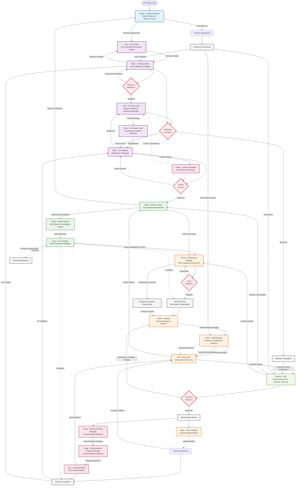

# UX Feature Development Workflow

## OpenShift AI Virtual Team - UX Feature Lifecycle

This diagram shows how a UX feature flows through the team from ideation to sustaining engineering, involving all 17 agents in their appropriate roles.

## Key Workflow Characteristics

### **Natural Collaboration Patterns**
- **Design Flow**: Aria → Uma → Felix → Steve (hierarchical design refinement)
- **Technical Flow**: Archie → Stella → Lee → Taylor (architecture to implementation)
- **Content Flow**: Casey → Tessa → Diego → Terry (strategy to execution)
- **Delivery Flow**: Parker → Derek → Olivia → Sam (business to sprint execution)

### **Decision Gates & Reviews**
1. **Research Validation** - Ryan validates user needs
2. **Design Review** - Uma/Felix/Steve collaborate on design approval  
3. **Capacity Assessment** - Emma ensures team sustainability
4. **Technical Review** - Archie/Stella/Phoenix assess implementation approach
5. **Validation Gate** - Uma/Ryan confirm feature readiness

### **Cross-Cutting Concerns**
- **Sam** facilitates all agile ceremonies throughout the process
- **Emma** monitors team health and capacity continuously  
- **Derek** tracks dependencies and delivery status across phases
- **Phoenix** assesses customer impact from technical planning through sustaining

### **Feedback Loops**
- User feedback from production flows back to Ryan for research insights
- Technical lessons learned flow back to Archie for architectural improvements
- Process improvements from retrospectives enhance future iterations

### **Parallel Work Streams**
- Development (Taylor) and Documentation (Terry) work concurrently
- UX validation (Steve/Uma) and User testing (Ryan) run in parallel
- Technical implementation and content creation proceed simultaneously

This workflow demonstrates realistic team collaboration with the natural tensions, alliances, and communication patterns defined in the agent framework.