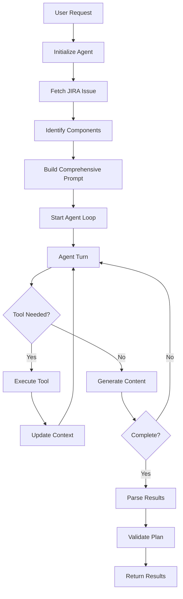

# Architecture Documentation

This document provides a comprehensive overview of the RHOAI AI Feature Sizing system architecture, including design patterns, component interactions, and technical decisions.

## 🏗️ System Overview

The RHOAI AI Feature Sizing system follows a **microservices architecture** with an **autonomous agent pattern** at its core. The system transforms JIRA feature requests into actionable implementation plans through intelligent automation.

### High-Level Architecture

```
┌─────────────────────────────────────────────────────────────────┐
│                        User Interfaces                          │
├─────────────────────┬─────────────────────┬─────────────────────┤
│   CLI Agent         │   Web UI (Planned)  │   API Clients       │
│   cli_agent.py      │   React/PatternFly   │   REST/WebSocket    │
└─────────────────────┴─────────────────────┴─────────────────────┘
                                │
                                ▼
┌─────────────────────────────────────────────────────────────────┐
│                     Application Layer                           │
├─────────────────────┬─────────────────────┬─────────────────────┤
│  Unified Agent      │   Simple API        │   RAG Service       │
│  unified_agent.py   │   simple_api.py     │   rag_service.py    │
│  - Planning Loop    │   - REST Endpoints  │   - Vector Search   │
│  - Custom Tools     │   - Job Management  │   - Doc Retrieval   │
└─────────────────────┴─────────────────────┴─────────────────────┘
                                │
                                ▼
┌─────────────────────────────────────────────────────────────────┐
│                      AI/ML Layer                                │
├─────────────────────┬─────────────────────┬─────────────────────┤
│   Llama Stack       │   Custom Tools      │   RAG Stores        │
│   - Model Inference │   - DB Operations   │   - Vector DBs      │
│   - Tool Execution  │   - Doc Generation  │   - Embeddings      │
│   - Session Mgmt    │   - Plan Validation │   - Retrieval       │
└─────────────────────┴─────────────────────┴─────────────────────┘
                                │
                                ▼
┌─────────────────────────────────────────────────────────────────┐
│                    Infrastructure Layer                         │
├─────────────────────┬─────────────────────┬─────────────────────┤
│   Database          │   External APIs     │   MCP Services      │
│   PostgreSQL/SQLite │   JIRA, LLM APIs    │   Atlassian MCP     │
│   - Sessions        │   - Issue Fetching  │   - JIRA Integration│
│   - Artifacts       │   - Model Inference │   - Tool Protocol   │
│   - Normalized Data │   - Authentication  │   - WebSocket/SSE   │
└─────────────────────┴─────────────────────┴─────────────────────┘
```

## 🧩 Core Components

### 1. Autonomous Agent (`UnifiedFeatureSizingAgent`)

**Purpose**: Central orchestrator that manages the feature planning process through a single autonomous loop.

**Key Characteristics**:
- **Single-prompt design**: Uses one comprehensive prompt to guide the entire planning process
- **Self-directed execution**: Agent decides which tools to use and when
- **Iterative refinement**: Continues until completion marker (`#FINAL_PLAN`) is reached
- **Tool integration**: Uses custom Llama Stack tools for persistence and operations

**Architecture Pattern**: Agent-Driven Architecture
```python
class UnifiedFeatureSizingAgent:
    async def run_planning_loop(self, session_id, jira_key, ...):
        # 1. Create agent with custom tools
        agent = await self._create_agent_with_tools()
        
        # 2. Build comprehensive prompt
        prompt = self._build_single_loop_prompt(jira_key, jira_data, components)
        
        # 3. Execute autonomous loop
        for turn in range(max_turns):
            response = await agent.run_turn(prompt)
            if "#FINAL_PLAN" in response:
                break
        
        # 4. Parse and return results
        return self._parse_final_results(responses)
```

### 2. Custom Tool System

**Purpose**: Extends Llama Stack with domain-specific operations for planning and persistence.

**Custom Tools**:
- `get_refinement_doc(session_uuid, jira_key)` - Retrieve refinement document
- `set_refinement_doc(session_uuid, jira_key, content)` - Save refinement document
- `get_jira_plan(session_uuid, jira_key)` - Retrieve JIRA plan
- `set_jira_plan(session_uuid, jira_key, plan_json)` - Save JIRA plan
- `patch_jira_plan(session_uuid, jira_key, json_patch_ops)` - Update JIRA plan

**Implementation Pattern**: Client-side tool functions
```python
def set_refinement_doc(session_uuid: str, jira_key: str, content: str) -> dict:
    """
    Save/update the refinement document for a session and JIRA key.
    """
    from .tools.planning_store_db import set_refinement
    return set_refinement(session_uuid, jira_key, content)
```

### 3. Database Layer (`planning_store_db.py`)

**Purpose**: Provides persistent storage for all planning artifacts with proper session management.

**Data Model**:
```
Sessions
├── id (UUID)
├── jira_key
├── created_at
└── status

Outputs
├── session_id (FK)
├── stage (enum)
├── filename
├── content (text)
└── created_at

Epics
├── session_id (FK)
├── title
├── component
├── status
└── stories (1:N)

Stories
├── epic_id (FK)
├── title
├── description
├── acceptance_criteria
├── story_points
└── status
```

**Storage Strategy**:
- **Session isolation**: All artifacts tied to unique session UUIDs
- **Dual storage**: Raw artifacts in `outputs` table + normalized data in `epics`/`stories`
- **Transactional operations**: Database operations wrapped in transactions
- **Flexible retrieval**: Support for both raw and structured queries

### 4. RAG Service (`rag_service.py`)

**Purpose**: Provides context-aware document retrieval for informed planning decisions.

**Architecture**:
- **Vector databases**: Multiple stores for different documentation types
- **Semantic search**: Embedding-based retrieval for relevant context
- **Scoped queries**: Component-specific searches for targeted results
- **Integration**: Seamless integration with Llama Stack tools

**Supported RAG Stores**:
- `rhoai_docs`: Red Hat OpenShift AI documentation
- `patternfly_docs`: PatternFly UI component documentation
- `kubernetes_docs`: Kubernetes API and operational documentation
- Custom stores: Extensible for team-specific documentation

## 🔄 Process Flow

### Autonomous Planning Workflow



### Data Flow

```
JIRA Issue (External)
    ↓ (MCP Atlassian)
Agent Context (Memory)
    ↓ (RAG Queries)
Enhanced Context (Documentation)
    ↓ (LLM Processing)
Refinement Document (Markdown)
    ↓ (Custom Tools)
Database Storage (PostgreSQL/SQLite)
    ↓ (Structured Parsing)
JIRA Plan (JSON + Normalized)
    ↓ (Validation)
Complete Feature Plan (Output)
```

## 🎨 Design Patterns

### 1. Agent-Driven Architecture

**Pattern**: Central autonomous agent that orchestrates the entire workflow
**Benefits**:
- Flexible execution paths based on context
- Self-correction and iteration capabilities
- Natural language interaction model
- Extensible through tool integration

### 2. Tool-Extensible Design

**Pattern**: Custom tools extend the agent's capabilities
**Benefits**:
- Domain-specific operations
- Database integration
- External API interactions
- Stateful operations across turns

### 3. Database-First Persistence

**Pattern**: All artifacts immediately persisted to database
**Benefits**:
- Session continuity
- Collaboration support
- Audit trail
- Recovery capabilities

### 4. RAG-Enhanced Context

**Pattern**: Retrieval-Augmented Generation for informed decisions
**Benefits**:
- Context-aware planning
- Documentation-driven insights
- Component-specific knowledge
- Scalable knowledge base

## 🏛️ Architectural Decisions

### Decision 1: Single-Prompt vs Multi-Stage Pipeline

**Chosen**: Single autonomous prompt with tool integration
**Rationale**:
- More flexible than rigid pipelines
- Self-correcting behavior
- Natural conversation flow
- Easier to extend and modify

**Trade-offs**:
- Less predictable execution paths
- Requires careful prompt engineering
- Higher complexity in error handling

### Decision 2: Custom Tools vs Built-in Functions

**Chosen**: Custom Llama Stack tools for specialized operations
**Rationale**:
- Direct database integration
- Stateful operations across agent turns
- Type-safe interfaces
- Extensible for future needs

**Trade-offs**:
- Additional complexity in tool management
- Dependency on Llama Stack tool system

### Decision 3: Database Storage Strategy

**Chosen**: Dual storage (raw + normalized)
**Rationale**:
- Raw artifacts for exact reproduction
- Normalized data for queries and analysis
- Flexibility for different use cases
- Support for future analytics

**Trade-offs**:
- Storage overhead
- Synchronization complexity
- Data consistency requirements

### Decision 4: PostgreSQL vs SQLite

**Chosen**: PostgreSQL for production, SQLite for development
**Rationale**:
- PostgreSQL: Multi-user, concurrent access, production-ready
- SQLite: Simple setup, single-user, development-friendly
- Configurable based on deployment environment

## 🔧 Technology Choices

### Core Technologies

| Component | Technology | Rationale |
|-----------|------------|-----------|
| **Agent Framework** | Llama Stack | Tool integration, session management, model abstraction |
| **Database** | PostgreSQL/SQLite | Relational data, ACID properties, mature ecosystem |
| **API Framework** | FastAPI | Async support, automatic docs, type hints |
| **ORM** | SQLAlchemy | Mature, flexible, supports both databases |
| **Vector Search** | Various (configurable) | Pluggable RAG backend support |
| **Serialization** | JSON/Pydantic | Type safety, validation, interoperability |

### Development Tools

| Purpose | Tool | Rationale |
|---------|------|-----------|
| **Package Management** | uv | Fast, modern, dependency resolution |
| **Code Formatting** | ruff | Fast, comprehensive, Python-specific |
| **Type Checking** | mypy | Static analysis, type safety |
| **Testing** | pytest | Mature, flexible, extensive ecosystem |
| **Documentation** | Markdown | Simple, version-controllable, widely supported |

## 🔒 Security Considerations

### Authentication & Authorization
- **API Keys**: Secure storage in environment variables or secrets
- **Database Access**: Connection string security
- **Session Isolation**: UUID-based session management
- **Input Validation**: Pydantic models for API inputs

### Data Privacy
- **JIRA Data**: Cached temporarily, not permanently stored
- **Generated Content**: User-owned, stored in user's database
- **RAG Context**: Documentation only, no sensitive data
- **Audit Trail**: All operations logged for compliance

### Network Security
- **TLS/SSL**: All external API communications encrypted
- **Internal Communications**: Secure service-to-service communication
- **Firewall Rules**: Restricted access to database and internal services

## 📊 Performance Characteristics

### Scalability
- **Horizontal Scaling**: Stateless API servers, shared database
- **Vertical Scaling**: CPU/memory scaling for LLM inference
- **Database Scaling**: PostgreSQL clustering and read replicas
- **Caching**: RAG results and JIRA data caching

### Performance Metrics
- **Planning Time**: 2-5 minutes per feature (typical)
- **Database Operations**: < 100ms for CRUD operations
- **RAG Queries**: < 2 seconds per query
- **Memory Usage**: ~500MB per active session

### Optimization Strategies
- **Connection Pooling**: Database connection reuse
- **Lazy Loading**: Load data only when needed
- **Batch Operations**: Group database writes
- **Caching**: Intelligent caching of expensive operations

## 🔄 Future Architecture Evolution

### Planned Enhancements

1. **Web UI Integration**
   - React frontend with PatternFly components
   - Real-time updates via WebSocket
   - Collaborative editing capabilities

2. **Advanced Analytics**
   - Feature complexity metrics
   - Estimation accuracy tracking
   - Team performance analytics

3. **Integration Ecosystem**
   - Webhook support for CI/CD
   - Slack/Teams notifications
   - GitHub/GitLab integration

4. **Multi-Tenant Architecture**
   - Organization-level isolation
   - Role-based access control
   - Resource quotas and limits

### Scalability Roadmap

- **Phase 1**: Single-tenant, single-region deployment
- **Phase 2**: Multi-tenant with organization isolation
- **Phase 3**: Multi-region with data replication
- **Phase 4**: Edge deployment for reduced latency

## 📚 References

- [Llama Stack Documentation](https://llama-stack.readthedocs.io/)
- [FastAPI Documentation](https://fastapi.tiangolo.com/)
- [SQLAlchemy Documentation](https://docs.sqlalchemy.org/)
- [PostgreSQL Documentation](https://www.postgresql.org/docs/)
- [Agent Design Patterns](https://arxiv.org/abs/2308.11432)
