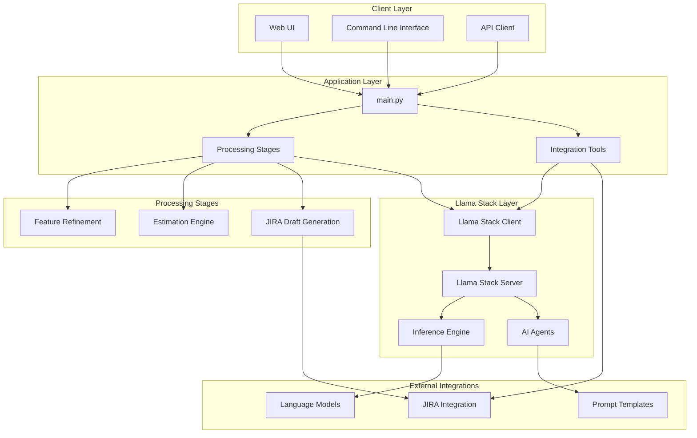
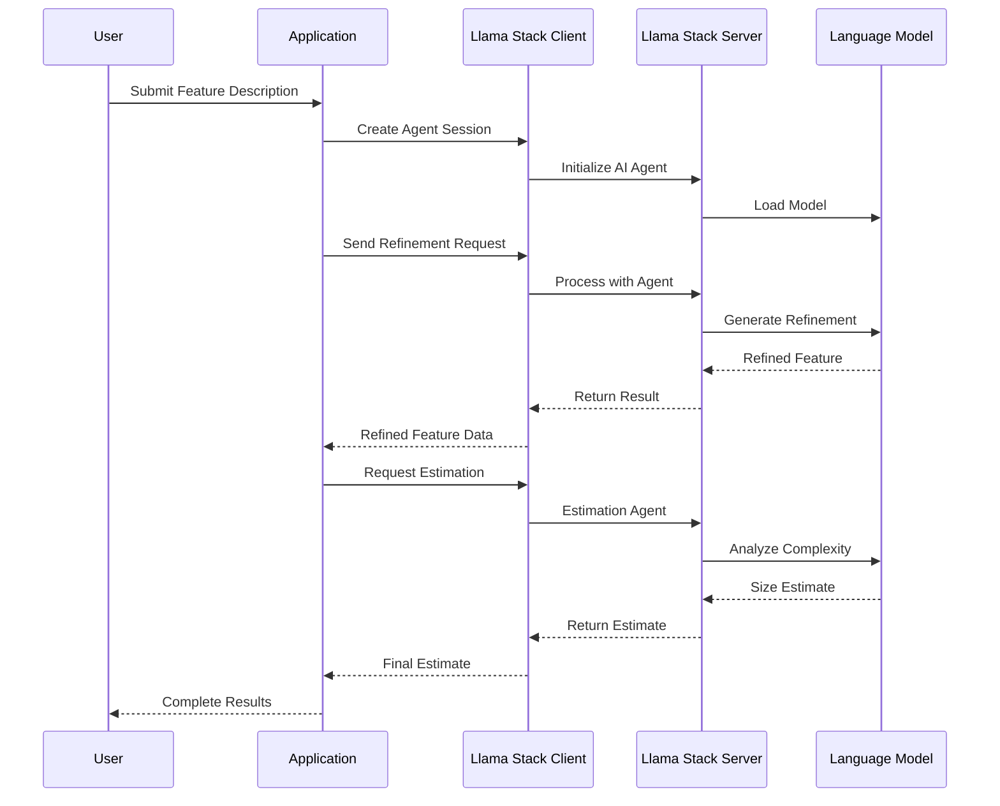

# System Architecture Overview

This document provides a high-level overview of the RHOAI AI Feature Sizing system architecture, built on [Llama Stack](https://llama-stack.readthedocs.io/en/latest/).

## 🏗️ Architecture Overview

The RHOAI AI Feature Sizing system is designed as a modular, AI-powered feature estimation platform that leverages Llama Stack for robust AI inference and processing capabilities.

## 🧩 Core Components

### 1. Application Layer

#### Main Application (`main.py`)
- Entry point for the application
- Orchestrates the feature sizing workflow
- Coordinates between different stages and tools

#### Processing Stages (`stages/`)
- **Feature Refinement** (`refine_feature.py`) - Analyzes and refines feature specifications
- **Estimation Engine** (`estimate.py`) - Performs AI-powered feature sizing
- **JIRA Draft Generation** (`draft_jiras.py`) - Creates structured JIRA tickets

#### Integration Tools (`tools/`)
- **JIRA Integration** (`mcp_jira.py`) - Handles JIRA API interactions and ticket management

### 2. Llama Stack Integration

The system leverages [Llama Stack](https://llama-stack.readthedocs.io/en/latest/) for:

- **AI Inference** - Processing natural language feature descriptions
- **Agent-based Processing** - Structured AI workflows for feature analysis
- **Model Management** - Handling different LLM models for specific tasks
- **Tool Integration** - Extensible tool ecosystem for external integrations

### 3. Prompt Management (`prompts/`)

Structured prompt templates for consistent AI interactions:
- Feature refinement prompts
- Estimation guidelines
- JIRA ticket formatting templates

## 🔄 Data Flow

### Feature Sizing Workflow

1. **Input Processing**
   - User provides feature description via CLI/API
   - Raw feature data is validated and preprocessed

2. **Feature Refinement**
   - Llama Stack agents analyze the feature description
   - Structured prompts guide the refinement process
   - Enhanced feature specification is generated

3. **Estimation Process**
   - AI agents evaluate complexity factors
   - Historical data and patterns are considered
   - Size estimates with confidence intervals are produced

4. **Output Generation**
   - JIRA tickets are drafted with sizing information
   - Integration tools handle external system updates
   - Results are returned to the user

### Llama Stack Integration Flow

## 🔧 Technology Stack

### Core Technologies
- **Python 3.12+** - Primary development language
- **Llama Stack** - AI inference and agent framework
- **uv** - Dependency management and virtual environments
- **Fire** - Command-line interface generation

### AI/ML Components
- **Llama Models** - Various Llama model variants for different tasks
- **Ollama** - Local model serving (development)
- **Vector Databases** - For RAG and context management
- **Embedding Models** - Text representation and similarity

### External Integrations
- **JIRA API** - Project management integration
- **REST APIs** - Various third-party service integrations

## 🔒 Security Considerations

### Authentication & Authorization
- API key management for external services
- Secure credential storage and rotation
- Role-based access control for different features

### Data Privacy
- Feature descriptions may contain sensitive information
- Local processing with Llama Stack reduces data exposure
- Configurable data retention policies

### Model Security
- Model validation and verification
- Input sanitization and validation
- Output filtering for sensitive content

## 📈 Scalability & Performance

### Horizontal Scaling
- Llama Stack server can be deployed in multiple instances
- Load balancing across inference servers
- Stateless application design for easy scaling

### Performance Optimization
- Model caching and warm-up strategies
- Batch processing for multiple features
- Asynchronous processing pipelines

### Resource Management
- GPU allocation for model inference
- Memory management for large contexts
- CPU optimization for data processing

## 🔍 Monitoring & Observability

### Logging
- Structured logging throughout the application
- Llama Stack telemetry integration
- Performance metrics and timing data

### Health Checks
- Application health endpoints
- Llama Stack server status monitoring
- External service connectivity checks

### Error Handling
- Graceful degradation for service failures
- Retry mechanisms with exponential backoff
- User-friendly error reporting

## 🚀 Deployment Considerations

### Development Environment
- Local Llama Stack setup with Ollama
- Development-specific configurations
- Hot-reload capabilities for rapid iteration

### Production Environment
- Containerized deployment options
- Kubernetes deployment strategies
- Load balancing and auto-scaling

### Configuration Management
- Environment-specific configurations
- Secret management integration
- Feature flags for gradual rollouts

## 🔄 Future Architecture Considerations

### Planned Enhancements
- Multi-model ensemble approaches
- Advanced RAG implementations
- Real-time collaboration features
- Enhanced JIRA integration

### Extensibility
- Plugin architecture for new estimation methods
- Custom prompt template system
- Additional project management tool integrations

---

For more detailed technical information, see:
- [Design Decisions](./decisions.md) - Key architectural decisions and rationale
- [Development Setup](../development/setup.md) - Setting up the development environment
- [API Documentation](../api/endpoints.md) - API specifications and usage

*This architecture is designed to be flexible and extensible, allowing for future enhancements while maintaining compatibility with the [Llama Stack ecosystem](https://llama-stack.readthedocs.io/en/latest/).*