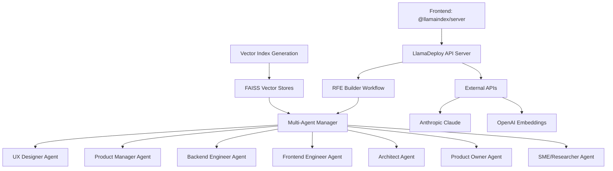

# Developer Guide

Welcome to the vTeam Developer Guide! This section provides comprehensive information for developers who want to contribute to, extend, or deeply understand the vTeam system.

## What You'll Learn

This guide covers technical implementation details and development workflows:

### 🔧 [Setup](setup.md)
- Development environment configuration
- Dependencies and tooling
- Local development workflow

### 🏗️ [Architecture](architecture.md)
- System design and component overview
- LlamaDeploy workflow orchestration
- Multi-agent coordination patterns

### 🔌 [Plugin Development](plugin-development.md)
- Creating custom agent personas
- Extending workflow capabilities
- Integration patterns and APIs

### 📚 [API Reference](api-reference.md)
- REST endpoint documentation
- Python API usage examples
- Response schemas and error codes

### 🤝 [Contributing](contributing.md)
- Code standards and review process
- Testing requirements and strategies
- Documentation guidelines

### 🧪 [Testing](testing.md)
- Unit testing strategies
- Integration testing with AI services
- Performance testing and benchmarks

## Developer Personas

This guide serves different development roles:

### **Backend Engineers**
Focus on LlamaDeploy workflows, agent orchestration, and API development.

### **Frontend Engineers**
Learn about the TypeScript chat interface and @llamaindex/server integration.

### **DevOps Engineers**
Understand deployment architecture, monitoring, and scalability considerations.

### **AI/ML Engineers**
Explore agent behavior customization, prompt engineering, and model integration.

### **QA Engineers**
Discover testing strategies for AI-powered workflows and integration patterns.

## Technology Stack

Understanding our core technologies:

### **Backend (Python)**
- **LlamaDeploy**: Production workflow orchestration and deployment
- **LlamaIndex**: RAG and document processing (v0.12+)
- **Uvicorn**: ASGI web server for API endpoints
- **FAISS**: Vector similarity search and indexing
- **Pydantic**: Data validation and serialization
- **YAML**: Agent configuration and deployment specs

### **Frontend (TypeScript)**
- **@llamaindex/server**: Modern chat interface framework
- **Node.js**: JavaScript runtime for frontend tooling
- **pnpm**: Fast, efficient package manager
- **WebSocket**: Real-time communication with backend

### **AI Integration**
- **Anthropic Claude**: Primary language model
- **OpenAI**: Embeddings and fallback model
- **Google Vertex AI**: Alternative AI provider

### **Development Tools**
- **uv**: Fast Python package manager and environment management
- **pytest**: Python testing framework
- **black/isort/flake8**: Code formatting and linting
- **mypy**: Static type checking
- **llamactl**: CLI tool for LlamaDeploy management
- **pre-commit**: Git hook automation

## Architecture Overview



## Development Workflow

### Quick Start for Contributors

1. **Fork and clone** the repository
2. **Set up development environment** following [Setup Guide](setup.md)
3. **Choose your area** - backend Python, frontend TypeScript, or documentation
4. **Read the contributing guidelines** in [Contributing](contributing.md)
5. **Start with a good first issue** labeled `good-first-issue`

### Code Organization

```
vTeam/
├── demos/rfe-builder/          # Main application
│   ├── src/                    # Core Python backend
│   │   ├── agents/             # Agent YAML configurations
│   │   ├── rfe_builder_workflow.py # Main LlamaDeploy workflow
│   │   ├── artifact_editor_workflow.py # Artifact editing workflow
│   │   └── settings.py         # System configuration
│   ├── ui/                     # TypeScript frontend (@llamaindex/server)
│   ├── deployment.yml          # LlamaDeploy deployment configuration
│   ├── pyproject.toml          # Python dependencies and build config
│   └── data/                   # Document sources for RAG
├── src/vteam_shared_configs/   # Shared configuration package  
└── docs/                       # Documentation (you are here!)
```

## Key Development Areas

### **Agent System Development**
Extend the multi-agent framework with new personas, specialized knowledge, and interaction patterns.

### **Workflow Engine Enhancement**  
Improve LlamaDeploy orchestration, add new workflow steps, and optimize performance.

### **RAG System Optimization**
Enhance document ingestion, vector search accuracy, and context relevance.

### **API & Integration Development**
Build new integrations, improve existing APIs, and enhance external service connections.

### **Frontend Experience**
Improve the chat interface, add visualization features, and enhance user experience.

## Getting Started

Choose your path based on your interests:

- **New to the codebase?** → Start with [Setup Guide](setup.md)
- **Want to understand the system?** → Read [Architecture](architecture.md)
- **Ready to build features?** → Check [Plugin Development](plugin-development.md)
- **Looking to contribute?** → Review [Contributing Guidelines](contributing.md)
- **Need API details?** → Explore [API Reference](api-reference.md)

## Quality Standards

We maintain high standards for code quality:

- **Test Coverage**: Minimum 80% for new code
- **Type Safety**: Full mypy compliance for Python
- **Code Style**: Automated formatting with black/isort
- **Documentation**: Comprehensive docstrings and examples
- **Performance**: Sub-5-second agent response times

## Community

Connect with other developers:

- **GitHub Discussions**: Technical questions and design decisions
- **Issue Tracker**: Bug reports and feature requests  
- **Pull Request Reviews**: Code collaboration and feedback
- **Documentation**: Help improve this developer guide

Let's build the future of AI-assisted software refinement together! 🚀