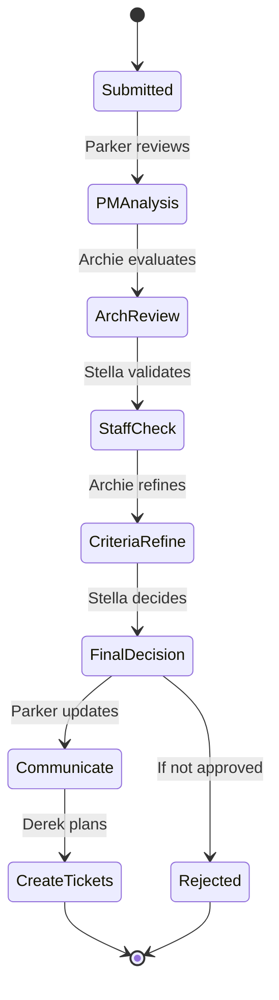

# Reference Documentation

This section provides comprehensive reference material for the vTeam system, including detailed specifications, API documentation, and configuration schemas.

## Quick Reference

### **[Agent Personas](agent-personas.md)** 🤖
Complete specifications for all 7 AI agents, including their roles, expertise areas, analysis frameworks, and interaction patterns.

### **[API Endpoints](api-endpoints.md)** 🌐
REST API documentation with request/response examples, authentication requirements, and error handling.

### **[Configuration Schema](configuration-schema.md)** ⚙️
Detailed configuration file formats, validation rules, and customization options for agents, workflows, and integrations.

### **[Glossary](glossary.md)** 📖
Definitions of terms, concepts, and acronyms used throughout the vTeam system and documentation.

## Agent System Reference

### Agent Council Overview

| Agent | Role | Primary Focus | Seniority Level |
|-------|------|---------------|-----------------|
| **Parker** | Product Manager | Business value, prioritization | Senior PM |
| **Archie** | Architect | Technical design, feasibility | Principal Architect |
| **Stella** | Staff Engineer | Implementation, complexity | Staff Engineer |
| **Olivia** | Product Owner | Acceptance criteria, scope | Senior PO |
| **Lee** | Team Lead | Coordination, execution | Engineering Manager |
| **Taylor** | Team Member | Development details | Senior Engineer |
| **Derek** | Delivery Owner | Planning, tickets | Delivery Manager |

### Workflow States



## API Reference Summary

### Base URLs
- **Development**: `http://localhost:8000`
- **Production**: `https://vteam.example.com/api`

### Authentication
```http
Authorization: Bearer your-api-key-here
Content-Type: application/json
```

### Core Endpoints

| Method | Endpoint | Purpose |
|--------|----------|---------|
| POST | `/deployments/rhoai/tasks/create` | Create new RFE analysis task |
| GET | `/deployments/rhoai/tasks/{id}` | Get task status and results |
| GET | `/deployments/rhoai/tasks/{id}/events` | Stream real-time task events |
| GET | `/health` | System health check |
| GET | `/agents` | List available agent personas |

## Configuration Reference

### Agent Configuration Schema

```yaml
# Agent persona definition
name: "Agent Display Name"
persona: "UNIQUE_IDENTIFIER" 
role: "Role description"
seniority: "junior|mid|senior|staff|principal"

# Knowledge sources
dataSources:
  - type: "local|github|web"
    source: "path-or-url"
    options:
      fileTypes: [".md", ".py"]
      path: "docs/"

# Analysis behavior  
analysisPrompt:
  template: "Analysis instructions with {variables}"
  templateVars: ["rfe_description", "context"]
  
# Response format
outputSchema:
  businessValue: "integer 1-10"
  complexity: "low|medium|high" 
  recommendation: "approve|reject|needs-info"
```

### System Configuration

```toml
# .streamlit/secrets.toml
[anthropic]
api_key = "sk-ant-api03-..."
model = "claude-3-5-sonnet-20241022"

[system]
max_concurrent_agents = 7
response_timeout_seconds = 120
enable_caching = true

[integrations]
jira_enabled = true
github_enabled = false
```

## Data Models

### RFE Structure

```python
class RFE(BaseModel):
    title: str
    description: str
    business_justification: str
    success_criteria: List[str]
    technical_considerations: Optional[str]
    priority: Literal["low", "medium", "high", "critical"]
    complexity: Optional[Literal["low", "medium", "high"]]
    estimated_effort: Optional[str]
```

### Agent Analysis Result

```python
class AgentAnalysis(BaseModel):
    agent_persona: str
    business_value: int  # 1-10 scale
    complexity_rating: str  # low/medium/high
    recommendation: str  # approve/reject/needs-info
    analysis: str  # Detailed reasoning
    concerns: List[str]  # Identified risks/issues  
    suggestions: List[str]  # Improvement recommendations
```

## Error Codes

### API Error Responses

| Code | Error | Description |
|------|-------|-------------|
| 400 | `INVALID_RFE_FORMAT` | RFE data doesn't match required schema |
| 401 | `UNAUTHORIZED` | Missing or invalid API key |
| 429 | `RATE_LIMITED` | Too many requests, retry after delay |
| 500 | `AGENT_ERROR` | AI agent processing failure |
| 503 | `SERVICE_UNAVAILABLE` | System maintenance or overload |

### Common Issues

#### Agent Timeout
```json
{
  "error": "AGENT_TIMEOUT",
  "message": "Agent analysis exceeded 120 second limit",
  "agent": "parker_pm", 
  "retry_after": 60
}
```

#### Invalid Configuration
```json
{
  "error": "CONFIG_VALIDATION_ERROR",
  "message": "Agent configuration failed schema validation",
  "details": {
    "field": "analysisPrompt.template",
    "issue": "Missing required template variable"
  }
}
```

## Performance Metrics

### Expected Response Times

| Operation | Target Time | Maximum Time |
|-----------|-------------|--------------|
| RFE Submission | < 2 seconds | 5 seconds |
| Single Agent Analysis | < 30 seconds | 60 seconds |
| Complete 7-Agent Workflow | < 3 minutes | 5 minutes |
| API Health Check | < 500ms | 2 seconds |

### System Limits

- **Concurrent RFEs**: 10 per user
- **RFE Length**: 10,000 characters maximum
- **Agent Context**: 50,000 tokens per analysis
- **API Rate Limit**: 100 requests per minute per API key

## Version History

### Current Version: v2.0.0

**Major Changes:**
- LlamaDeploy workflow orchestration
- TypeScript frontend with @llamaindex/server
- Enhanced agent persona system
- Production-ready deployment architecture

**Breaking Changes:**
- API endpoints moved from `/api/v1/` to `/deployments/rhoai/`
- Agent configuration schema updated
- Authentication now requires Bearer tokens

### Migration Guide

Upgrading from v1.x? See the [Migration Guide](../developer-guide/migration.md) for step-by-step instructions.

## Support

### Getting Help

- **Documentation Issues**: [GitHub Issues](https://github.com/red-hat-data-services/vTeam/issues)
- **API Questions**: [GitHub Discussions](https://github.com/red-hat-data-services/vTeam/discussions)
- **Bug Reports**: Include system info, error messages, and reproduction steps

### System Information

To help with support requests, gather this information:

```bash
# Version info
git describe --tags

# System details  
python --version
streamlit --version

# Environment check
pip list | grep -E "(anthropic|streamlit|llamaindex)"
```

---

This reference documentation is maintained alongside the codebase. Found an error or missing information? [Submit a pull request](https://github.com/red-hat-data-services/vTeam/pulls) or [create an issue](https://github.com/red-hat-data-services/vTeam/issues).