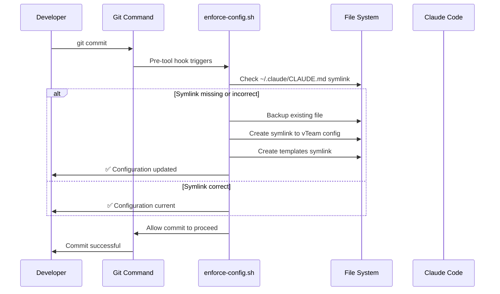
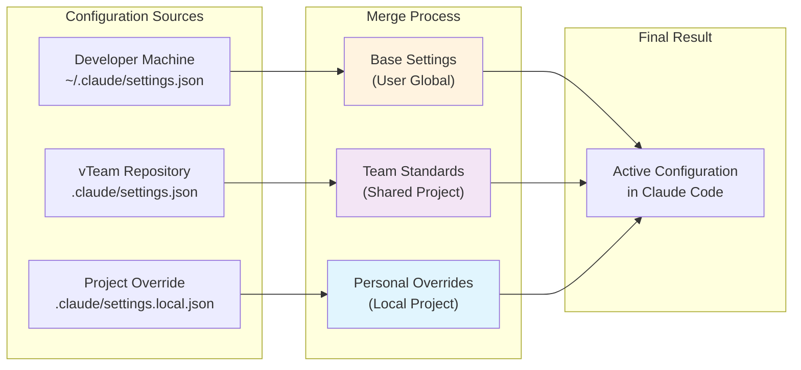
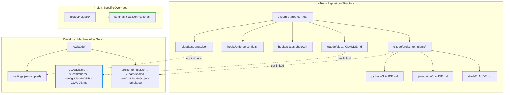

# vTeam Claude Configuration Installation Guide

Comprehensive setup instructions for vTeam shared Claude Code configurations.

## Quick Setup (Recommended)

Use the vteam-config CLI tool:

```bash
pip install vteam-shared-configs
vteam-config install
```

This handles everything automatically including backups and verification.

## Manual Setup

If you prefer manual installation or need to troubleshoot:

### 1. Install Global Configuration

```bash
# Create .claude directory if needed
mkdir -p ~/.claude

# Link global configuration
ln -sf "$(pwd)/claude/global-CLAUDE.md" ~/.claude/CLAUDE.md

# Link project templates
ln -sf "$(pwd)/claude/project-templates" ~/.claude/
```

### 2. Add Convenience Aliases (Optional)

Add to your shell configuration (~/.bashrc, ~/.zshrc, etc.):

```bash
# vTeam Claude template aliases
alias claude-python="cp ~/.claude/project-templates/python-CLAUDE.md ./CLAUDE.md"
alias claude-js="cp ~/.claude/project-templates/javascript-CLAUDE.md ./CLAUDE.md"  
alias claude-shell="cp ~/.claude/project-templates/shell-CLAUDE.md ./CLAUDE.md"

# Reload shell configuration
source ~/.bashrc  # or ~/.zshrc
```

## Usage

### For New Projects
```bash
# Use automated installation aliases
claude-python    # Copy Python template
claude-js        # Copy JavaScript template  
claude-shell     # Copy Shell template

# Or copy manually
cp ~/.claude/project-templates/python-CLAUDE.md ./CLAUDE.md
```

### For Existing Projects
1. Choose appropriate template from `~/.claude/project-templates/`
2. Copy to project root as `CLAUDE.md`
3. Customize development commands and architecture for your project

## Verification

### Check Installation
```bash
# Verify global config symlink
ls -la ~/.claude/CLAUDE.md

# Verify project templates symlink  
ls -la ~/.claude/project-templates

# Check project config exists
ls -la ./CLAUDE.md
```

### Test Configuration
```bash
# Test with Claude Code
claude --help

# Check project-specific guidance loads
claude "What are the development commands for this project?"
```

## Directory Structure After Setup

```
~/.claude/
├── CLAUDE.md -> /path/to/vTeam/shared-configs/claude/global-CLAUDE.md
└── project-templates/ -> /path/to/vTeam/shared-configs/claude/project-templates/

vTeam/shared-configs/
├── install.sh              # Automated installation
├── uninstall.sh            # Automated removal
├── update.sh               # Update configuration
├── README.md               # Team documentation
├── .gitignore              # Development ignore rules
├── CLAUDE.md               # Project template
├── LICENSE                 # MIT license
├── .github/dependabot.yml  # Dependency automation
└── claude/
    ├── INSTALL.md           # This file
    ├── global-CLAUDE.md     # Global team standards
    └── project-templates/
        ├── python-CLAUDE.md
        ├── javascript-CLAUDE.md
        └── shell-CLAUDE.md
```

## Lifecycle Management

### Update Configuration
```bash
vteam-config update
```
Updates to latest team configuration.

### Uninstall
```bash
vteam-config uninstall
```
Removes configuration and restores backups.

## Troubleshooting

### Symlinks Not Working
```bash
# Check if path is correct
ls -la ~/.claude/CLAUDE.md

# Recreate symlink
rm ~/.claude/CLAUDE.md
ln -sf "/full/path/to/vTeam/shared-configs/claude/global-CLAUDE.md" ~/.claude/CLAUDE.md
```

### Templates Not Found
```bash
# Verify templates directory
ls ~/.claude/project-templates/

# Recreate templates symlink
rm ~/.claude/project-templates
ln -sf "/full/path/to/vTeam/shared-configs/claude/project-templates" ~/.claude/
```

### Restore Previous Configuration
```bash
# Find backup directory
ls -la ~/.claude-backup-*

# Manually restore if needed
cp ~/.claude-backup-YYYYMMDD-HHMMSS/CLAUDE.md ~/.claude/
```

## Detailed Configuration Flow

### Hook Execution Sequence



### Configuration Hierarchy Deep Dive



### File System Layout



## Team Benefits

This setup provides:
- ✅ **Consistent standards** across all team projects
- ✅ **Automatic enforcement** via pre-commit hooks
- ✅ **Developer flexibility** through local overrides
- ✅ **Zero maintenance** - configuration stays current
- ✅ **Version controlled** team standards
- ✅ **Visual workflow** documentation for team collaboration