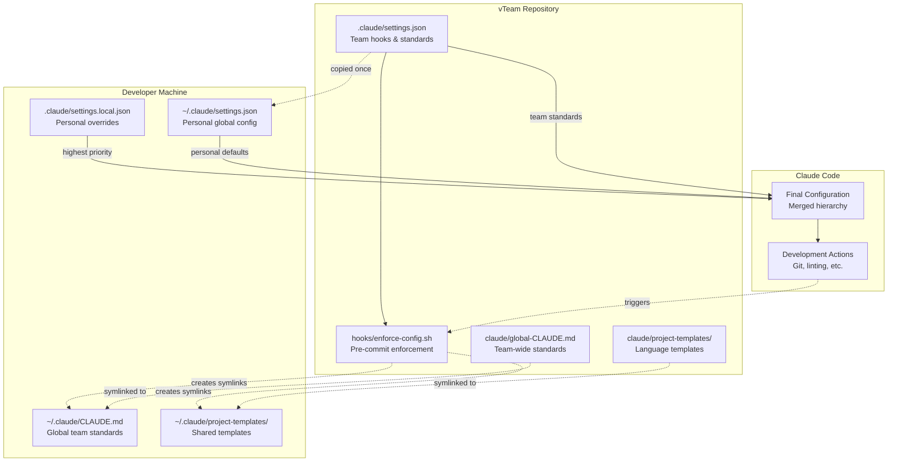

# vTeam Shared Claude Configuration

> Shared Claude Code configuration templates and standards for team development

## Quick Start

```bash
# Install the package
pip install vteam-shared-configs

# Install team configuration
vteam-config install

# Start using Claude Code with team standards!
# Configuration is now active and enforced
```

## How It Works

### Configuration Hierarchy

```mermaid
flowchart TD
    A[Developer Action] --> B{Claude Settings Hierarchy}
    B --> C[".claude/settings.local.json<br/>🏆 HIGHEST PRIORITY<br/>Personal overrides<br/>(never committed)"]
    B --> D[".claude/settings.json<br/>📋 TEAM STANDARDS<br/>vTeam shared config<br/>(in git repository)"]
    B --> E["~/.claude/settings.json<br/>⚙️ PERSONAL DEFAULTS<br/>Global user settings<br/>(copied from team)"]
    C --> F[Final Configuration]
    D --> F
    E --> F
    F --> G[Claude Code Execution]
```



### Developer Workflow

```mermaid
sequenceDiagram
    participant Dev as Developer
    participant PyPI as PyPI Package Registry
    participant Claude as Claude Code
    participant Config as vTeam Config
    
    Dev->>PyPI: pip install vteam-shared-configs
    Dev->>Config: vteam-config install
    Config->>Claude: Auto-create ~/.claude/CLAUDE.md symlink
    Config->>Claude: Auto-create ~/.claude/project-templates symlink
    Config->>Claude: Install team hooks configuration
    Config->>Dev: ✅ Team configuration active
    
    Dev->>Claude: Start Claude session
    Config->>Dev: Display configuration status
    
    Note over Dev: All development uses team standards
```



## Overview

This directory contains shared Claude Code configuration files that provide:

- **Consistent development standards** across team projects
- **Automatic enforcement** via Claude Code hooks
- **Reusable project templates** for common technologies  
- **Developer override flexibility** with clear hierarchy
- **Best practices** for code quality and team collaboration

## What's Included

### Core Configuration Files

- **`.claude/settings.json`** - Team hooks and enforcement rules
- **`.gitignore`** - Comprehensive ignore rules for development files
- **`CLAUDE.md`** - Project-specific Claude Code guidance template  
- **`LICENSE`** - MIT license for open source projects
- **`.github/dependabot.yml`** - Automated dependency management

### Hooks & Enforcement

- **`hooks/enforce-config.sh`** - Pre-commit configuration enforcement
- **`hooks/status-check.sh`** - Session start status display
- **Automatic symlink management** - Global config and templates
- **Pre-commit/push validation** - Ensures team standards

### Global Configuration

- **`claude/global-CLAUDE.md`** - Team-wide Claude Code standards
- **Development principles** - Git workflow, code quality, testing
- **File management standards** - Branch verification, linting requirements
- **Team collaboration guidelines** - GitHub Flow, commit standards

### Project Templates

Pre-configured CLAUDE.md templates for:

- **`python-CLAUDE.md`** - Python projects with uv, black, pytest
- **`javascript-CLAUDE.md`** - JavaScript/Node.js projects  
- **`shell-CLAUDE.md`** - Shell script projects with ShellCheck

## Installation

### Package Installation (Recommended)

```bash
# Install package
pip install vteam-shared-configs

# Set up configuration
vteam-config install

# Check status
vteam-config status
```

### Manual Setup (Development)

If working with the source repository:

```bash
# Create .claude directory
mkdir -p ~/.claude

# Link global configuration
ln -sf "$(pwd)/claude/global-CLAUDE.md" ~/.claude/CLAUDE.md

# Link project templates
ln -sf "$(pwd)/claude/project-templates" ~/.claude/
```

## Usage

### For New Projects

1. **Copy project template** to your project root as `CLAUDE.md`:
   ```bash
   cp ~/.claude/project-templates/python-CLAUDE.md myproject/CLAUDE.md
   ```

2. **Customize for your project** - update architecture, commands, etc.

3. **Start development** with Claude Code understanding your project context

### For Existing Projects

1. **Add CLAUDE.md** using appropriate template as starting point
2. **Update development commands** to match your project's needs
3. **Follow team standards** from global configuration

## Configuration Management

### Automatic Updates
- **Hooks enforce latest config** on every Git commit/push
- **No manual updates needed** - configuration stays current
- **Session status checks** display current configuration state

### Manual Updates (if needed)
```bash
# Pull latest changes
git pull origin main

# Hooks will automatically update configuration on next Git operation
# Or run manually:
./hooks/enforce-config.sh
```

## Developer Customization

### Configuration Hierarchy (Highest → Lowest Priority)
1. **Local Project Settings** (`.claude/settings.local.json`) - **Your overrides** 
2. **Shared Project Settings** (`.claude/settings.json`) - **vTeam standards**
3. **User Global Settings** (`~/.claude/settings.json`) - **Personal defaults**

### Personal Overrides

Create `.claude/settings.local.json` in any project for personal customizations:

```json
{
  "hooks": {
    "postToolUse": [
      {"name": "my-logging", "command": "echo 'Tool used'"}
    ]
  },
  "permissions": {
    "allow": ["Bash(my-custom-tool:*)"]
  }
}
```

### File Structure & Configuration Flow



**What you CAN override:**
- ✅ Add personal hooks and automation
- ✅ Extend permissions for custom tools
- ✅ Personal workflow preferences
- ✅ Custom aliases and shortcuts

**What gets enforced:**
- 🔒 Pre-commit/push configuration validation
- 🔒 Core team development standards
- 🔒 Quality and linting requirements

## Team Standards

### Git Workflow
- **Always work in feature branches** unless explicitly told otherwise
- **Mandatory branch verification** before any file modifications
- **Squash commits** for clean history
- **Follow GitHub Flow** for all repositories

### Code Quality
- **Run linters locally** before every commit/push
- **Never push** if linters report errors or warnings
- **Use language-specific tooling** (black for Python, prettier for JS, etc.)
- **Always run tests** before pushing changes

### Development Environment
- **Use virtual environments** for Python projects (prefer `uv` over `pip`)
- **Automate dependency management** with dependabot
- **Document project-specific commands** in project CLAUDE.md

## Contributing

To update shared configuration:

1. **Create feature branch** from main
2. **Make changes** to templates, hooks, or global config
3. **Test changes** locally by copying `.claude/settings.json`
4. **Create pull request** with clear description of changes
5. **Team review** before merging

## Support

- **Documentation**: See `claude/INSTALL.md` for detailed setup
- **Issues**: Report problems via GitHub Issues
- **Questions**: Reach out to team leads for guidance

---

**Latest Update**: Hook-based automatic configuration management
**Compatibility**: Claude Code with hierarchical settings and project-specific CLAUDE.md support